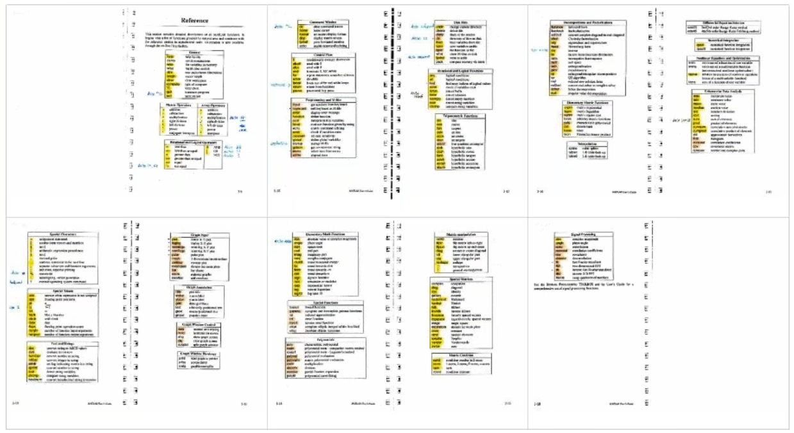
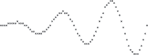
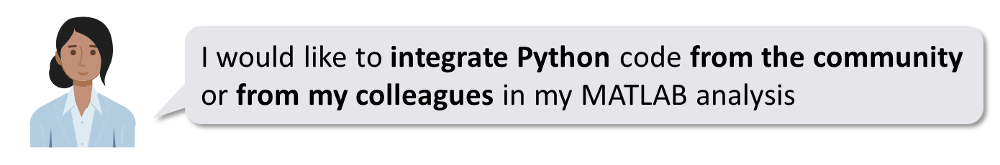
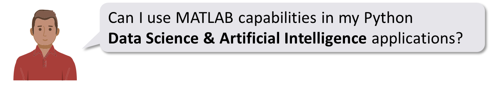

# 1. Introduction

Engineers and scientists that I meet every day think about MATLAB &
Python as MATLAB **<u>vs</u>** Python. The goal of this book is to prove
to them that it is possible to think about it as MATLAB **<u>with</u>**
Python.

Python recently became the most used programming language according to the [TIOBE index](https://www.tiobe.com/tiobe-index/). It is
general purpose by nature, and it is particularly used for scripting,
web development and Artificial Intelligence (Machine Learning & Deep
Learning).

MATLAB is mostly seen as a programming language for technical computing,
and a development environment for engineers and scientists. But MATLAB
also provides flexible two-way integration with many programming
languages including Python.

MATLAB works with common python distributions. For this book I will be
using Python 3.10 (downloaded on
[Python.org](https://www.python.org/downloads/)) and MATLAB 2023a.

## 1.1. A brief history of scientific computing

### 1.1.1. The roots of numerical analysis

In the 1970s, Cleve Moler took actively part in the development of
Fortran libraries called [EISPACK](https://en.wikipedia.org/wiki/EISPACK) (to compute eigenvalues) and
[LINPACK](https://en.wikipedia.org/wiki/LINPACK) (for linear algebra). As he was professor of Mathematics at
the University of New Mexico, he wanted to make those libraries
accessible to student while sparing them the need to write Fortran
wrapper code, compile it, debug it, compile again, run, …

So he created an interactive interpreter in Fortran for matrix
computation, called MATLAB (short for MATrix LABoratory, nothing to do
with the Matrix movie, that came out 30 years later). This first version
was based on a few routines from EISPACK and LINPACK and only contained
80 functions.

This photo of a MATLAB manual at the time, shows the scope of the
software in its early days.

At that time MATLAB was not yet a programming language. It had no file
extension (m-scripts), no toolboxes. The only available datatype was
matrices. The graphic capabilities were asterisks drawn on the screen
(not Astérix The Gaul).

In order to add a function, you had to modify the Fortran source code
and recompile everything. So the source code was open, because it needed
to be (open-source only appeared in the 80s, with Richard Stallman and
the Free Software movement).

After a course on numerical analysis that Cleve Moler gave at Stanford
University in California, an MIT trained engineer came to him: “I
introduced myself to Cleve”. This is the way Jack Little tells the story
about their first encounter. Jack Little had anticipated the possible
use of MATLAB on PC, and rewritten it in C. He knew, like Steve Jobs and
Bill Gates that Personal Computing would win over the mainframe server
business of IBM. He also added the ability to write program files to
extend the capabilities of the software, and toolboxes that would become
a well architectured, modular and scalable business model. In 1984, he
created the company (The) MathWorks to commercialize MATLAB.

**Read more about the origins of MATLAB:**

-   A history of MATLAB – published in June 20202 -
    <https://dl.acm.org/doi/10.1145/3386331>

-   The Origins of MATLAB
    <https://www.mathworks.com/company/newsletters/articles/the-origins-of-matlab.html>

-   Cleve’s Corner – History of MATLAB Published by the ACM
    <https://blogs.mathworks.com/cleve/2020/06/13/history-of-matlab-published-by-the-acm/?doing_wp_cron=1642533843.1107759475708007812500>

### 1.1.2. In a parallel universe

In the 1980s, Guido van Rossum was working at the [Centrum Wiskunde &
Informatica](https://en.wikipedia.org/wiki/Centrum_Wiskunde_%26_Informatica) (abbr. **CWI**;
English: "National Research Institute for Mathematics and Computer
Science") on a language called ABC.

“ABC was intended to be a programming language that could be taught to
intelligent computer users who were not computer programmers or software
developers in any sense. During the late 1970s, ABC's main designers
taught traditional programming languages to such an audience. Their
students included various scientists—from physicists to social
scientists to linguists—who needed help using their very large
computers. Although intelligent people in their own right, these
students were surprised at certain limitations, restrictions, and
arbitrary rules that programming languages had traditionally set out.
Based on this user feedback, ABC's designers tried to develop a
different language.”

In 1986 Guido van Rossum moved to a different project at CWI, the Amoeba
project. Amoeba was a distributed operating system. By the late 1980s,
they realized that they needed a scripting language. With the freedom he
was given inside this project, Guido van Rossum started his own “mini
project”.

In December 1989, Van Rossum had been looking for a "'hobby' programming
project that would keep \[him\] occupied during the week around
Christmas" as his office was closed when he decided to write an
interpreter for a "new scripting language \[he\] had been thinking about
lately: a descendant of ABC that would appeal to Unix/C hackers". He
attributes choosing the name "Python" to "being in a slightly irreverent
mood (and a big fan of Monty Python's Flying Circus)". 
[(Foreword for “Programming Python” Guido van Rossum, 1996)](https://www.python.org/doc/essays/foreword/ )

He wrote a simple virtual machine, a simple parser and a simple runtime.
He created a basic syntax, using indentation for statement grouping. And
he developed a small number of datatypes: dictionaries, lists, strings
and numbers. Python was born.

In Guido’s opinion, his most innovative contribution to Python’s success
was making it easy to extend.

**Main milestones of the Python language:**
- 1991: Python 0.9.0 published to alt.sources by Guido Van Rossum
- 1994: Python 1.0. include functional programming (lambda’s map, filter, reduce)
- 2000: Python 2.0 introduces list comprehension and garbage collection
- 2008: Python 3 fixes fundamental design flaws and is not backward compatible
- 2022: Python 2 is end of life, last version 2.7.18 released

**Read more about Python:**

-   The Making of Python - A Conversation with Guido van Rossum, Part I
    <https://www.artima.com/articles/the-making-of-python>

-   Microsoft Q&A with Guido van Rossum, Inventor of Python  
    <https://www.youtube.com/watch?v=aYbNh3NS7jA>

-   The Story of Python, by Its Creator, Guido van Rossum  
    <https://www.youtube.com/watch?v=J0Aq44Pze-w>

-   Python history timeline infographics  
    <https://python.land/python-tutorial/python-history>

## 1.2. About the author

My name is Yann Debray, and I work for MathWorks, as a MATLAB Product
Manager. You will probably think that I am biased, in that I am trying
to sell you MATLAB. That’s not wrong. But to better understand my
motivations, you need to look a little deeper into my background.

I joined MathWorks in June 2020 (in the middle of the COVID-19
pandemic). Prior to that, I spent 6 years working on a project called
[Scilab](https://scilab.org/). Scilab is an open-source alternative to MATLAB. This experience
translates my appetite for open-source and scientific computing.

My first encounter with numerical computing was in December 2013, when I
first met [Claude Gomez](https://www.d-booker.fr/content/81-interview-with-claude-gomez-ceo-of-scilab-enterprises-about-scilab-and-its-development). He was the CEO of Scilab Enterprises back
then, and the one who had turned Scilab from a research project to a
company. The business model was inspired from Red Hat selling services
around Linux.

I know very well the challenge of making open-source a sustainable model
in scientific computing, and that is the reason why I believe in an
equilibrium in the force, between open-source and proprietary software.
Not every software can be free. The expertise required in fields like
simulation – requiring decades of investments – we will still observe
entire markets of engineering software driven by intellectual property
for the years to come.

## 1.3. Open-source vs Commercial

One of the early questions around this book was:
*Do I commercialize it, or do I make it open-source?*
I had an idealized view of what it would mean to write a book. The fame and the glamour. But pragmatically, I know it is not going to sell a lot, as it is quite niche. My best estimate for a target audience is around 30% of the 5 million users of MATLAB, that are also interested in Python.
Beyond my idealism on open-source, I felt like I needed concrete motivation to see this project through. Hence my initial idea to sell a hard copy of this book. But my dear colleague and good friend Mike Croucher advised me against what he calls “dead wood”. Hinting to the fact that the printed content would quickly become obsolete with every new version of MATLAB (twice a year).
Finally, I’ve decided that open-sourcing the content does not conflict with releasing a paid version of the book. In fact, when I buy technical books, I often decide for those who apply an open-source license.

## 1.4. Who is this book for?

If you recognize yourself in the following scenario, this book is for
you:

You are an engineer or a researcher using MATLAB, and you are increasingly hearing about Python. This comes up particularly in subjects related to data science & artificial intelligence. When searching for code online, you might stumble on interesting scripts or packages written in Python. Or when working with colleagues that are using Python, you may be looking for ways to integrate their work:

You are (or want to become) a Data Scientist, and you are working on scientific / engineering data (wireless, audio, video, radar/lidar, autonomous driving,…). You will probably be using Python for some of your daily operations related to data processing, but you may want to consider MATLAB for the engineering part of your AI workflow (especially if this intelligence will be integrated on embedded systems). If this part is covered by engineer colleagues, you might simply want to be able to run the models and scripts that they share with you:

