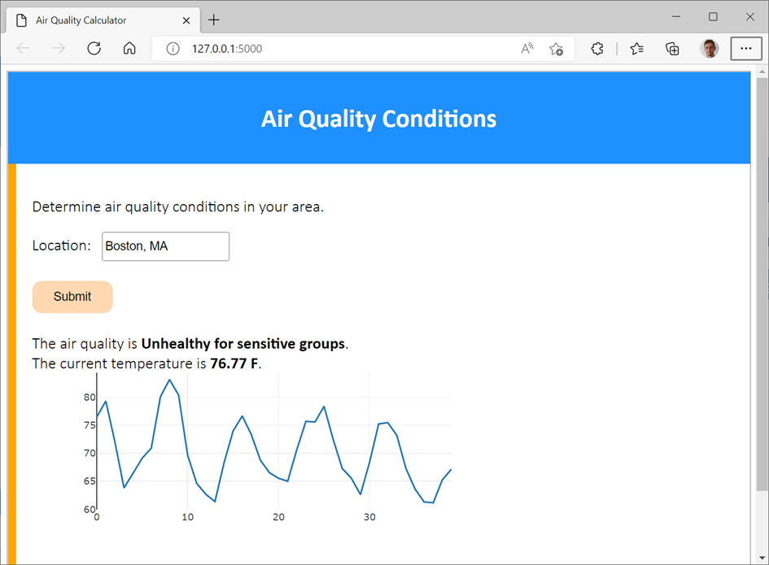
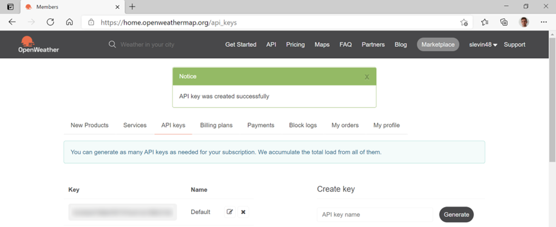
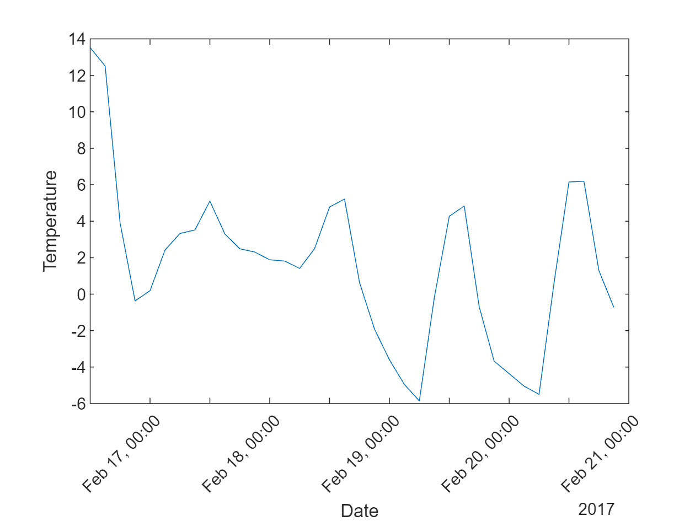
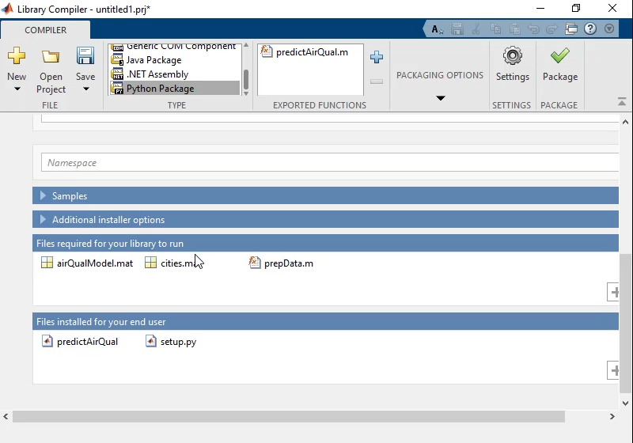

# 2. End-to-end project with MATLAB & Python

When I joined MathWorks, I met Heather. She had developed a really good demo to illustrate the use of MATLAB with Python. In this first chapter, I’ll show the **Weather Forecasting app** she developed. You can find the code on her GitHub repo: [https://github.com/hgorr/weather-matlab-python ](https://github.com/hgorr/weather-matlab-python )


Start by retrieving the code by downloading a zip or cloning the repository: 


```matlab
!git clone https://github.com/hgorr/weather-matlab-python
cd weather-matlab-python\
```


The resulting application will look like this:





We will work in steps to:


   1.  Call Heather's python code to retrieve the weather data  
   1.  Integrate a MATLAB model predicting the air quality 
   1.  Deploy the resulting application made out of MATLAB + Python 


In this example we will be using data from a web service at [openweathermap.org](https://openweathermap.org/)


In order to access this live data, you will need to [register](https://home.openweathermap.org/users/sign_up) to
the free tier offering. You will then have the option to generate an API
key: <https://home.openweathermap.org/api_keys>




This key will be necessary for each call of the web service. For
instance, requesting the [current weather](https://openweathermap.org/current) will be performed by
calling the following address:


`api.openweathermap.org/data/2.5/weather?q={city name}\&appid=`[`{API key}`](https://home.openweathermap.org/api_keys)


Save your [API key](https://home.openweathermap.org/api_keys) in a text file called <u>accessKey.txt</u>.


```matlab
% apikey = fileread("accessKey.txt");
```


Alternatively you can use the sample API key (as demonstrated in this script)


```matlab
appid ='b1b15e88fa797225412429c1c50c122a1';
```


# 2.1. Call Python from MATLAB


Heather has created a module called [weather.py](https://github.com/hgorr/weather-matlab-python/blob/main/weather.py) that reads from the web service and parses the JSON data it returns. Of course, we can do this in MATLAB, but let’s use this module as an example of accessing data from Python.


## 2.1.1. Check the Python installation


First connect to the Python environment using the [pyenv](https://www.mathworks.com/help/matlab/ref/pyenv.html) command. For more details on how to set-up MATLAB and Python, look at the next chapter. MATLAB can call python functions and create python objects from base Python, from packages you've installed and from your own Python code. 


```matlab
pyenv % Use pyversion for MATLAB versions before R2019b
```


```text:Output
ans = 
  PythonEnvironment with properties:

          Version: "3.10"
       Executable: "C:\Users\ydebray\AppData\Local\WPy64-31040\python-3.10.4.amd64\python.exe"
          Library: "C:\Users\ydebray\AppData\Local\WPy64-31040\python-3.10.4.amd64\python310.dll"
             Home: "C:\Users\ydebray\AppData\Local\WPy64-31040\python-3.10.4.amd64"
           Status: NotLoaded
    ExecutionMode: OutOfProcess

```

## 2.1.2. Call Python user-defined functions from MATLAB


Now let's see how to use my colleague's weather module. We will start by getting the data for today. The [get_current_weather](https://github.com/hgorr/weather-matlab-python/blob/c8985b96b4c4a64b283573a5276d25f33f311bcc/weather.py#L16) function in the weather module gets the current weather conditions in Json format. The [parse_current_json](https://github.com/hgorr/weather-matlab-python/blob/c8985b96b4c4a64b283573a5276d25f33f311bcc/weather.py#L42) function then returns that data as a python dictionary. 


```matlab
jsonData = py.weather.get_current_weather("London","UK",appid,api='samples')
```


```text:Output
jsonData = 
  Python dict with no properties.

    {'coord': {'lon': -0.13, 'lat': 51.51}, 'weather': [{'id': 300, 'main': 'Drizzle', 'description': 'light intensity drizzle', 'icon': '09d'}], 'base': 'stations', 'main': {'temp': 280.32, 'pressure': 1012, 'humidity': 81, 'temp_min': 279.15, 'temp_max': 281.15}, 'visibility': 10000, 'wind': {'speed': 4.1, 'deg': 80}, 'clouds': {'all': 90}, 'dt': 1485789600, 'sys': {'type': 1, 'id': 5091, 'message': 0.0103, 'country': 'GB', 'sunrise': 1485762037, 'sunset': 1485794875}, 'id': 2643743, 'name': 'London', 'cod': 200}

```


```matlab
weatherData = py.weather.parse_current_json(jsonData)
```


```text:Output
weatherData = 
  Python dict with no properties.

    {'temp': 280.32, 'pressure': 1012, 'humidity': 81, 'temp_min': 279.15, 'temp_max': 281.15, 'speed': 4.1, 'deg': 80, 'lon': -0.13, 'lat': 51.51, 'city': 'London', 'current_time': '2023-03-15 16:04:38.427888'}

```

## 2.1.3. Convert Python data to MATLAB data


Let’s convert the [Python dictionary](https://docs.python.org/3/tutorial/datastructures.html#dictionaries) into a [MATLAB structure](https://www.mathworks.com/help/matlab/ref/struct.html):


```matlab
data = struct(weatherData)
```


```text:Output
data = 
            temp: 280.3200
        pressure: [1x1 py.int]
        humidity: [1x1 py.int]
        temp_min: 279.1500
        temp_max: 281.1500
           speed: 4.1000
             deg: [1x1 py.int]
             lon: -0.1300
             lat: 51.5100
            city: [1x6 py.str]
    current_time: [1x26 py.str]

```


Most of the data gets automatically converted. Only some fields did not find an obvious equivalent:


   -  `pressure` \& `humidity` remain as a `py.int` object in MATLAB. 
   -  `city` and `current_time `remain as a `py.str` object in MATLAB. 


We can convert them explicitly using standard MATLAB functions like [double](https://www.mathworks.com/help/matlab/ref/double.html), [string](https://www.mathworks.com/help/matlab/characters-and-strings.html) and [datetime](https://www.mathworks.com/help/matlab/date-and-time-operations.html):


```matlab
data.pressure = double(data.pressure);
data.humidity = double(data.humidity);
data.deg = double(data.deg);
data.city = string(data.city);
data.current_time = datetime(string(data.current_time))
```


```text:Output
data = 
            temp: 280.3200
        pressure: 1012
        humidity: 81
        temp_min: 279.1500
        temp_max: 281.1500
           speed: 4.1000
             deg: 80
             lon: -0.1300
             lat: 51.5100
            city: "London"
    current_time: 15-Mar-2023 16:04:38

```

## 2.1.4. Convert Python lists to MATLAB matrices


Now let's call the [get_forecast](https://github.com/hgorr/weather-matlab-python/blob/c8985b96b4c4a64b283573a5276d25f33f311bcc/weather.py#L67) function which returns a series of predicted weather conditions over the next few days. We can see that the fields of the structure are returned as [Python list](https://docs.python.org/3/tutorial/datastructures.html#more-on-lists): 


```matlab
jsonData = py.weather.get_forecast('Muenchen','DE',appid,api='samples');
forecastData = py.weather.parse_forecast_json(jsonData);  
forecast = struct(forecastData)
```


```text:Output
forecast = 
    current_time: [1x36 py.list]
            temp: [1x36 py.list]
             deg: [1x36 py.list]
           speed: [1x36 py.list]
        humidity: [1x36 py.list]
        pressure: [1x36 py.list]

```


Lists containing only numeric data can be converted into doubles (since MATLAB R2022a):


```matlab
forecast.temp = double(forecast.temp) - 273.15; % from Kelvin to Celsius
forecast.temp
```


```text:Output
ans = 1x36    
   13.5200   12.5100    3.9000   -0.3700    0.1910    2.4180    3.3280    3.5200    5.1030    3.3050    2.4890    2.3090    1.8850    1.8150    1.4120    2.4980    4.7770    5.2170    0.6470   -1.9110   -3.5970   -4.9520   -5.8550   -0.1940    4.2720    4.8340   -0.6910   -3.6770   -4.3570   -5.0440   -5.4950    0.6000    6.1520    6.1930    1.2930   -0.7260

```


Lists containing text can be transformed to strings, and further processed into specific data types like datetime:


```matlab
forecast.current_time = string(forecast.current_time);
forecast.current_time = datetime(forecast.current_time);
forecast.current_time
```


```text:Output
ans = 1x36 datetime    
16-Feb-2017 12:00:0016-Feb-2017 15:00:0016-Feb-2017 18:00:0016-Feb-2017 21:00:0017-Feb-2017 00:00:0017-Feb-2017 03:00:0017-Feb-2017 06:00:0017-Feb-2017 09:00:0017-Feb-2017 12:00:0017-Feb-2017 15:00:0017-Feb-2017 18:00:0017-Feb-2017 21:00:0018-Feb-2017 00:00:0018-Feb-2017 03:00:0018-Feb-2017 06:00:0018-Feb-2017 09:00:0018-Feb-2017 12:00:0018-Feb-2017 15:00:0018-Feb-2017 18:00:0018-Feb-2017 21:00:0019-Feb-2017 00:00:0019-Feb-2017 03:00:0019-Feb-2017 06:00:0019-Feb-2017 09:00:0019-Feb-2017 12:00:0019-Feb-2017 15:00:0019-Feb-2017 18:00:0019-Feb-2017 21:00:0020-Feb-2017 00:00:0020-Feb-2017 03:00:00

```


Read more about mapping data between Python and MATLAB (section 4.7)


## 2.1.5. Explore graphically the Python data imported in MATLAB

```matlab
plot(forecast.current_time,forecast.temp)
xtickangle(45)
xlabel('Date')
ylabel('Temperature')
```




## 2.1.6. Call a Machine Learning model in MATLAB


Now let's suppose we have used some historical data to create a machine learning model that takes a set of weather conditions and returns a prediction of the air quality.  My Python colleague wants to make use of my model in her Python code.


First, let's see how the air quality prediction works.  There are three steps:


   -  Load the model from a .mat file 
   -  Convert the current weather data from openweathermap.org to the format expected by the model 
   -  Call the predict method of the model to get the expected air quality for that day 


```matlab
load airQualModel.mat model
testData = prepData(data);
airQuality = predict(model,testData)
```


```text:Output
airQuality = 
     Good 

```


To give this to my colleague, I'm going to pack up these steps into a single function called [predictAirQuality](https://github.com/hgorr/weather-matlab-python/blob/main/predictAirQual.m): 


```matlab
function airQual = predictAirQual(data)
% PREDICTAIRQUAL Predict air quality, based on machine learning model
%
%#function CompactClassificationEnsemble

% Convert data types  
currentData = prepData(data);

% Load model
mdl = load("airQualModel.mat");
model = mdl.model;

% Determine air quality
airQual = predict(model,currentData);

% Convert data type for use in Python
airQual = char(airQual);

end
```


This function does the same three steps as above – loads the model, converts the data, and calls the model's predict method.  


However, it has to do one other thing.  The model returns a MATLAB categorical value which doesn't have a direct equivalent in Python, so we convert it to a character array.


Now that we have our MATLAB function that uses the air quality prediction model, let's see how to use it in Python.


## 2.2. Call MATLAB from Python

Here we'll demonstrate calling MATLAB from Python using a Jupyter
notebook.

The first step is to use the engine API to start a MATLAB running in the
background for Python to communicate with (we will assume here that
you’ve installed it already – else check [section 3.8](3_Set-up_MATLAB_and_Python.md)).

```python
>>> import matlab.engine
>>> m = matlab.engine.start_matlab()
```

Once the MATLAB is running, we can call any MATLAB function on the path.

```python
>>> m.sqrt(42.0)
6.48074069840786
```

We need to access the key from the txt file:

```python
>>> with open("accessKey.txt") as f:
...   apikey = f.read()
```

Now we can use the get_current_weather and the parse_current_json
functions from the weather module just like we did in MATLAB to get the
current weather conditions.

```python
>>> import weather
>>> json_data = weather.get_current_weather("Boston","US",apikey)
>>> data = weather.parse_current_json(json_data)
>>> data
{'temp': 62.64, 'feels_like': 61.9, 'temp_min': 58.57, 'temp_max': 65.08, 'pressure': 1018, 'humidity': 70, 'speed': 15.01, 'deg': 335, 'gust': 32.01, 'lon': -71.0598, 'lat': 42.3584, 'city': 'Boston', 'current_time': '2022-05-23 11:28:54.833306'}
```

Then we can call the MATLAB function predictAirQuality to get the
predicted result.

```python
>>> aq = m.predictAirQuality(data)
>>> aq
Good
```

The last step is to shutdown the MATLAB started by the engine API at the
beginning of our notebook.
```python
>>> m.exit()
```
However, your Python colleague might not have access to MATLAB. The next
two sections will target this use case.

## 2.3. Generate a Python package from a set of MATLAB functions

For this, you will need to use a dedicated toolbox called [MATLAB
Compiler SDK](https://www.mathworks.com/help/compiler_sdk/). You can select the Library Compiler in the Apps
ribbon, or enter in the Command Window (`libraryCompiler`):



Simply select the MATLAB function(s) that you want to turn them into
Python functions. The dependencies will be automatically added to the
Python package (in this case, the Air Quality Model, the list of cities,
and the pre-processing function).

This packages the files we need and creates
a *setup.py* and *readme.txt* file with instructions for the Python
steps. To learn more on how to set-up the generated package read the
[section 6.1](#set-up-of-the-generated-python-package).

Then we need to import and initialize the package and can call the
functions, like so:
```python
>>> import AirQual
>>> aq = AirQual.initialize()
>>> result = aq.predictAirQual(data)
```
When we’re finished, wrap things up by terminating the process:
```python
>>> aq.terminate()
```
We can go one step further in sharing the MATLAB functionality to be
used as a web service (and potentially accessed by many users at once).
In this case, [MATLAB Production
Server](https://www.mathworks.com/help/mps/index.html) can be used
for load balancing and the MATLAB code can be accessed through
a [RESTful
API](https://www.mathworks.com/help/mps/restful-api-and-json.html) or [Python
client](https://www.mathworks.com/help/mps/python/create-a-matlab-production-server-python-client.html).
