# 3. Set-up MATLAB and Python

## 3.1. Install Python

You can simply go to
[www.python.org/downloads](https://www.python.org/downloads/) and select
a [version of Python compatible with your MATLAB version](https://www.mathworks.com/support/requirements/python-compatibility.html)

For instance, this is the list of versions compatible with the latest
releases:

| MATLAB Version | Compatible Versions of Python 2 | Compatible Versions of Python 3 |
|----------------|---------------------------------|---------------------------------|
| R2023a         | 2.7                             | 3.9, 3.10                       |
| R2022b         | 2.7                             | 3.8, 3.9, 3.10                  |
| R2022a         | 2.7                             | 3.8, 3.9                        |
| R2021b         | 2.7                             | 3.7, 3.8, 3.9                   |

### 3.1.1. Install Python on Windows

If you are running on Windows, download the [Windows installer
(64-bit)](https://www.python.org/ftp/python/3.10.10/python-3.10.10-amd64.exe):
the file <u>python-3.10.10-amd64.exe</u> is only 28Mo. Just run this
executable (you can uncheck the admin privileges):

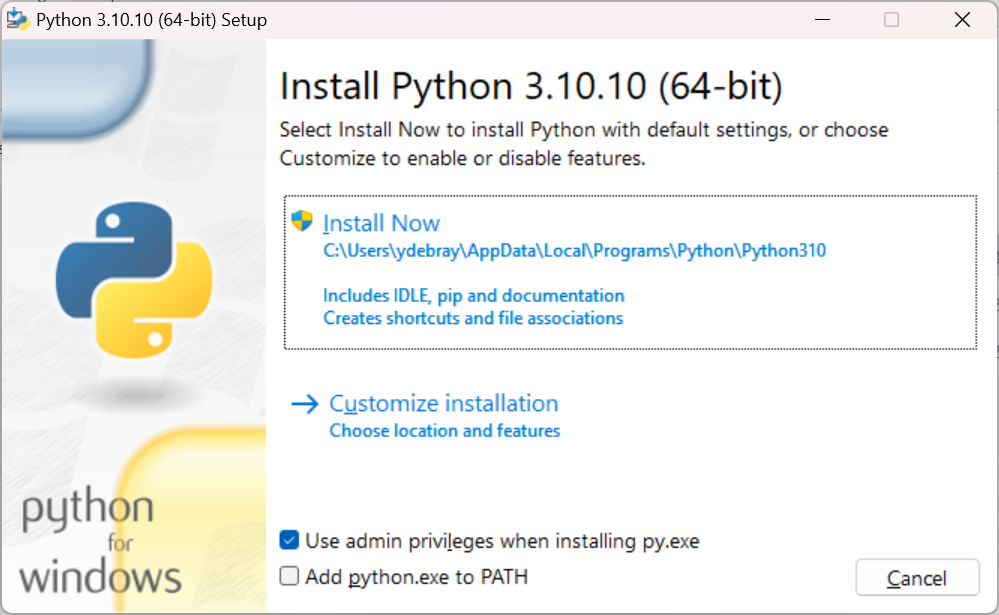

By default, the checkbox “Add python.exe to PATH” isn’t checked. 
I would advise you to select it (Otherwise, you will have to add Python to your PATH manually):

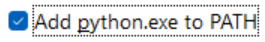


Select `-> Install Now`:

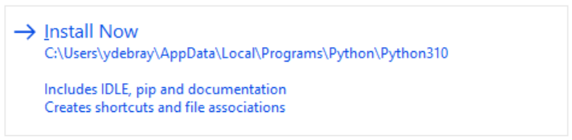

It should only take about a minute to get everything installed on your
machine.

The following applications have been installed and are accessible from
your Start menu:

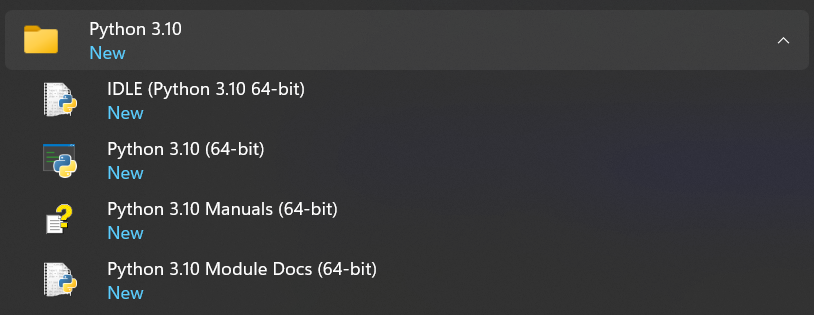

To check that you have Python installed and available to your PATH, open
a command prompt:
```
C:\Users\ydebray>where python
C:\Users\ydebray\AppData\Local\Programs\Python\Python310\python.exe
C:\Users\ydebray\AppData\Local\Microsoft\WindowsApps\python.exe
```
If you have several versions of Python installed, it will return each of
them, in the order listed in your PATH, plus the last one that isn’t
actually installed:
```
C:\Users\ydebray\AppData\Local\Microsoft\WindowsApps\python.exe
```
This is a link to a version packaged on the Microsoft Store. If you run
it, you’ll be redirect to the Store:

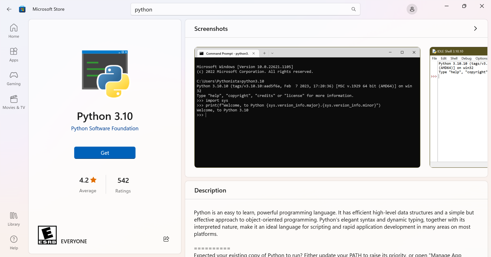

## 3.2. Install Anaconda or other Python distribution

With the previous version installed, you only have the base Python
language. No numerical packages, or Development Environment (unlike
MATLAB that ships all of those features by default). To get a set of
curated data science packages pre-installed, you can download a
distribution, like Anaconda:

<u>Be aware of the fact that you now need to comply with [Anaconda’s
terms of services](https://www.anaconda.com/terms-of-service) (since September 2020): You can only use the open-source
[Anaconda Distribution](https://www.anaconda.com/products/individual) professionally for free if you
are not part of an organization with more than 200 employees. Otherwise,
you will need to buy a license of [Anaconda Professional](https://www.anaconda.com/products/professional).</u>

If you are searching for an alternative distribution to Anaconda, I
would recommend [WinPython](https://winpython.github.io/) on Windows. If you are running on Linux,
I believe you don’t need a distribution and can manage packages
yourself.

### 3.2.1. Install Miniconda from conda-forge

[Conda-forge](https://conda-forge.org/) provides [installers of the conda](https://github.com/conda-forge/miniforge) package manager that point by default to the community channel, to remain in compliance with the terms of use of the Anaconda repo, even for “commercial activities”. 

Download and run the installer of miniforge (55 MB):


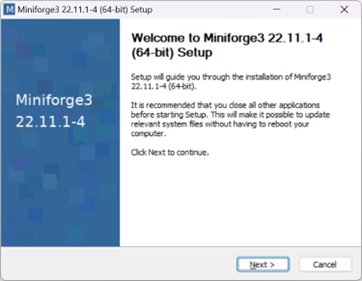

### 3.2.2. Install Micromamba for minimal footprint


[micromamba](https://mamba.readthedocs.io/) is a 4 MB pure-C++ drop-in replacement for the conda package manager. Unlike pip or conda, it is not written in Python, so you don’t need to get Python to get it, and it can retrieve python:

On Linux:
```
curl micro.mamba.pm/install.sh | bash
```

```
(base) $ mamba install python
```


## 3.3. Manage your PATH

When you have several versions of Python installed, the command python
returns the version that is higher up in your PATH. To check which version of Python is used by default:
```
C:\Users\ydebray>python --version
Python 3.10.10
```
To change this, you
will need to modify your [PATH](https://en.wikipedia.org/wiki/PATH_(variable))

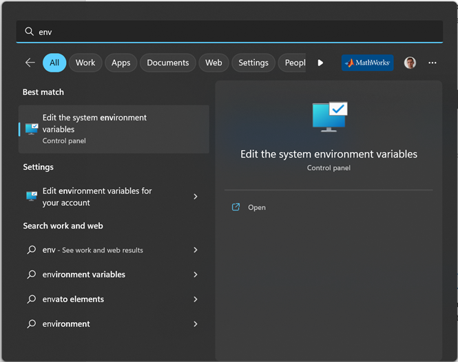

You can edit your PATH in **environment variables**, by tipping “path”
in the search bar of your Windows start menu. Select the Path in the
user variables (it will be written on top of the system variables):

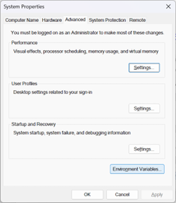
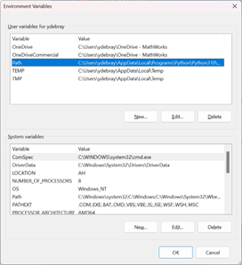

You can modify the order in which each version of Python is listed in
the PATH. And in order to access pip (the Python default package
manager), make sure to also list the Script folder in the PATH:
`C:\Users\ydebray\AppData\Local\Programs\Python\Python310\Scripts`

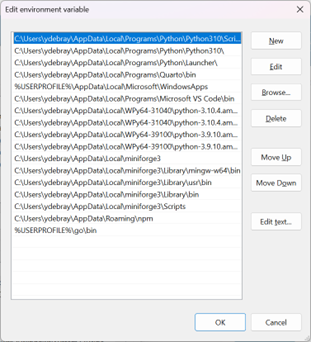

## 3.4. Install additional Python packages

In order to retrieve additional packages from the [Python Package
Index](https://pypi.org/), use the pip command:
```
C:\Users\ydebray>pip install pandas
```
This will for instance install the famous [pandas](https://pandas.pydata.org) package. It will
also automatically retrieve its dependencies (in this case numpy,
python-dateutil, pytz).

You can check if a package is installed by calling the method pip show.
It will show information about this package:
```
C:\Users\ydebray>pip show pandas
Name: pandas
Version: 1.3.3
Summary: Powerful data structures for data analysis, time series, and
statistics
Home-page: https://pandas.pydata.org
Author: The Pandas Development Team
Author-email: pandas-dev@python.org
License: BSD-3-Clause
Location:
c:\users\ydebray\appdata\local\programs\python\python39\lib\site-packages
Requires: numpy, python-dateutil, pytz
Required-by: streamlit, altair
```
To upgrade a package previously installed with a new version:
```
C:\Users\ydebray>pip install --upgrade pandas
```
## 3.5. Set up a Python virtual environment

If you have different projects leveraging different versions of the same
package, or if you want a way to replicate your production environment
in a clean space, use [Python virtual environment](https://docs.python.org/3/tutorial/venv.html). It’s a type of
virtualization at the language level (like Virtual Machine at the
Machine level, or Docker container at the Operating System level). This
is the default way (shipped with base Python) to create a virtual
environment called `env`:
```
C:\Users\ydebray>python -m venv env
```
You then need to activate it

 - On Windows:
```
C:\Users\ydebray>.\env\Scripts\activate
```
 - On Linux:
```
$ source env/bin/activate
```
Once you’ve done that you can install the libraries you want, for
instance from a list of requirements:
```
C:\Users\ydebray>pip install -r requirements.txt
```
## 3.6. Set up a Python Development Environment

Once you've installed Python and the relevant packages for scientific computing, you still don't quite have the same experience as with the MATLAB Integrated Development Environment (IDE).

Two key open-source technologies are taking a stab at reshaping the tech computing landscape:

-   Jupyter Notebooks
-   Visual Studio Code

They are redefining the way *Languages* and *Development environments*
are interacting. Based on open standards for interactive computing first
with Jupyter. Adding richer interaction for multiple languages in the
IDE, with the VS Code Language Server Protocol.

### 3.6.1. Jupyter Notebooks


Jupyter Notebooks have become over the years, one of the most used and
appreciated data science tools. They combine text (as Markdown), code,
and output (numerical and graphical). Notebooks help data scientist to
communicate goals, methods and results. It can be seen as an executable
form of textbook or scientific paper.

Jupyter stands for Julia, Python and R, but it is also an homage to
Galileo’s notebooks recording the discovery of the moons of Jupiter.
Those notebooks were probably one of the first instance of open science,
data-and-narrative papers. When Galileo published the Sidereal Messenger
in 1610 (one of the first scientific paper), he actually published his
observations with code and data. It was a log of the dates and the
states of the night. There was data and metadata, and there was a
narrative.


Jupyter is a project that spun off in [2014](https://speakerdeck.com/fperez/project-jupyter) from IPython. IPython
stands for Interactive Python and was created in 2001 by Fernando Perez.
He drew his inspiration from Maple and Mathematica that both had
notebook environments. He really liked the Python language, but he felt
limited by the interactive prompt to do scientific computing. So he
wrote a python startup file to provide the ability to hold state and
capture previous results for reuse, and adding some nice features like
loading the Numeric library and Gnuplot. ['ipython-0.0.1'](https://gist.github.com/fperez/1579699) was born,
a mere 259 lines to be loaded as $PYTHONSTARTUP.

Around 2006, the IPython project took some inspiration from another
open-source project called [Sage](https://www.sagemath.org/). The Sage Notebook was taking the
route of using the filesystem for notebook operations. You couldn’t
meaningfully list files with `ls` or move around the filesystem by
changing directory with `cd`. Sage would execute your code in hidden
directories with each cell actually being a separate subdirectory.

In 2010, the architecture of IPython evolved by separating the notebook
front-end from the kernel executing Python code, and communicating
between the two with the [ZeroMQ protocol](https://zeromq.org/). This design enabled the
development of a Qt client, a Visual Studio extension, and finally a web
frontend.


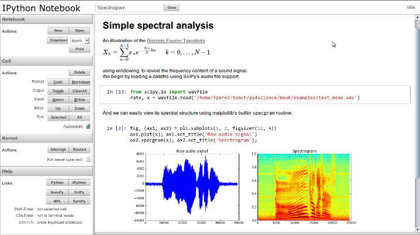

IPython gave turn to Jupyter, to become language agnostic. Jupyter
supports execution environments (aka kernels) in several dozen languages
among which are Julia, R, Haskell, Ruby, and of course Python (via the
IPython kernel)... and [MATLAB](https://github.com/Calysto/matlab_kernel) (via a kernel maintained by the community and building on the MATLAB Engine for Python).

To summarize, Jupyter provides 3 key *components* to the modern
scientific computing stack:

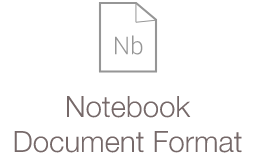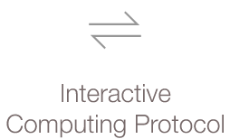
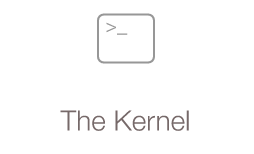

Some of the testimonies of the pervasive success of Jupyter in data
science are the development of additional capabilities from the
ecosystem:

-   Running Notebooks on Google Colab
-   Render Notebooks on GitHub


**Read more on Jupyter:**

-   The scientific paper is obsolete, by James Somers – The Atlantic –
    APRIL 5, 2018  
    <https://www.theatlantic.com/science/archive/2018/04/the-scientific-paper-is-obsolete/556676/>

-   The IPython notebook: a historical retrospective  
    <http://blog.fperez.org/2012/01/ipython-notebook-historical.html>

-   A Brief History of Jupyter Notebooks  
    <https://ep2020.europython.eu/media/conference/slides/7UBMYed-a-brief-history-of-jupyter-notebooks.pdf>

-   The First Notebook War - Martin Skarzynski
    <https://www.youtube.com/watch?v=QR7gR3njNWw>


### 3.6.2. MATLAB Integration for Jupyter

MathWorks has released an official kernel for Jupyter in January 2023. In addition to this, you also have a way to integrate the MATLAB full environment as an app inside of a JupyterHub server installation. You can find this app easier in the 'New' menu, or if you are using JupyterLab, as an icon in the launcher:

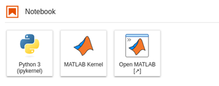
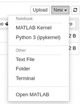

To find out how to install this on your JupyterHub server:  
- https://github.com/mathworks/jupyter-matlab-proxy 
- https://www.mathworks.com/products/reference-architectures/jupyter.html 
- https://blogs.mathworks.com/matlab/2023/01/30/official-mathworks-matlab-kernel-for-jupyter-released/ 


### 3.6.3. Visual Studio Code

I adopted VS Code when I discovered that it was supporting
Jupyter/IPython Notebook ipynb files.

As any other Integrated Development Environment, VS Code supports writing scripts and executing them in several languages (Python,
Javascript, …)

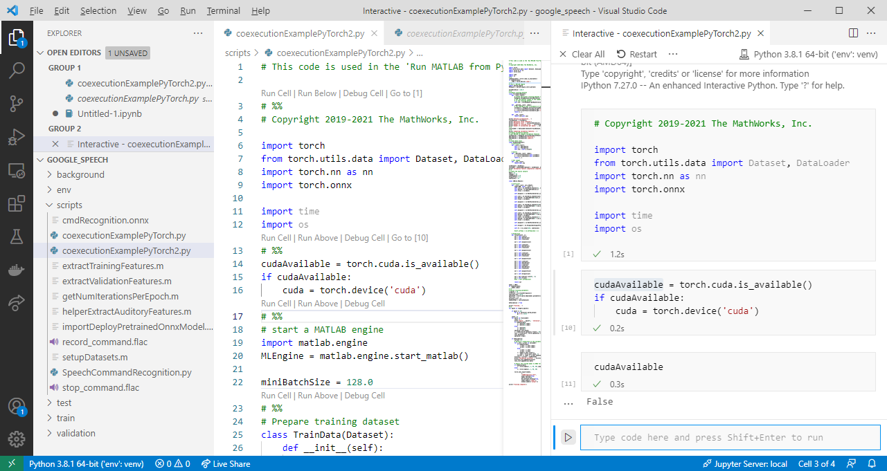

The big difference with the [Eclipse](https://en.wikipedia.org/wiki/Eclipse_(software)) approach to componentization is the
web standards adopted, called [Language Server Protocol](https://microsoft.github.io/language-server-protocol/overviews/lsp/overview/):

This enables to have richer interactions between the development tool and the language server.
And since it is all based on web technologies, you can access a web version at [vscode.dev](https://vscode.dev/). Unlike for web languages like HTML/JS, this does not enable the execution of Python as it would require an interpreter running in the browser, or a server to connect to. Some hacks exist based on [Pyodide](https://pyodide.org/en/stable/index.html) (a port of Python to WebAssembly).


## 3.7. Connect MATLAB to Python

You can connect your MATLAB session to Python using the
[pyenv](https://www.mathworks.com/help/matlab/ref/pyenv.html) command
since 2019b. Before that, use
[pyversion](https://www.mathworks.com/help/matlab/ref/pyversion.html)
(introduced in 2014b).

If you have multiple Python versions installed, you can specify which
version to use, either with:
```
>> pyenv('Version','3.8')
```
or
```
>> pyenv('Version','C:\Users\ydebray\AppData\Local\Programs\Python\  
Python38\python.exe')
```
This is also the way to connect to Python virtual environments:
```
>> pyenv('Version','env/Scripts/python.exe)
```
In your project folder, where you created your virtual environment called `env`, you simply need to point to the Python executable that is contained in the Scripts subfolder.

**Execution Mode:**

By default, Python runs in the same process as MATLAB. On the plus side, it means that you don’t have overhead for inter-process data exchange between the two systems. But it also means that if Python encounters an error and crashes, then MATLAB crashes as well. This can happen when MATLAB uses different versions of the same library than a given package. For this reason, the [Out-of-Process execution mode](https://www.mathworks.com/help/matlab/matlab_external/out-of-process-execution-of-python-functionality.html ) has been introduced :
```
>> pyenv("ExecutionMode","OutOfProcess")
```
**Setup Tips:**
- Ensure all code is on path (both on the MATLAB and [Python side](https://github.com/hgorr/matlab-with-python/blob/master/setUpPyPath.m))
- Check environment settings, depending on how you set up Python
- In Out-of-Process Execution, you can [terminate the Python process](https://www.mathworks.com/help/matlab/ref/pythonenvironment.terminate.html)

## 3.8. Install the MATLAB Engine API for Python 

Since the [MATLAB Engine for Python](https://pypi.org/project/matlabengine/) has been added to the Python Package Index (mid-April 2022), you can simply install it with the pip command:
```
C:\Users\ydebray>pip install matlabengine
```
Before that and for release prior to MATLAB R2022a, you had to [install in manually](
https://www.mathworks.com/help/matlab/matlab_external/install-the-matlab-engine-for-python.html):
```
cd "matlabroot\extern\engines\python"
python setup.py install
```

On Linux, you need to make sure that the default install location of MATLAB by calling `matlabroot` in a MATLAB Command Window. By default, Linux installs MATLAB at:
`/usr/local/MATLAB/R2023a`
