# 4. Call Python from MATLAB

Why would you want to call Python from MATLAB. There could be a number
of reasons.

First, as a single user. You might want to grab features available in
Python. For instance, specialized libraries in fields like AI: Machine
Learning with Scikit-Learn or XGBoost, Deep-Learning with TensorFlow or
PyTorch, Reinforcement Learning with OpenAI Gym, …

Second, if you are working with colleagues that developed Python
functions, that you would like to leverage as a MATLAB user, without the
need to recode.

Third, if you are deploying your MATLAB Application in a Python-based
environment, where some of the services, for instance for data access
like in the case of the weather app from the first chapter, are written
in Python.

## 4.1. Execute Python statements and files in MATLAB


Since R2021b, you can run Python statements directly from MATLAB with [pyrun](https://www.mathworks.com/help/matlab/ref/pyrun.html). This is convenient to simply run short snippets of Python code, without having to wrap it into a script.


```matlab
pyrun("l = [1,2,3]")
pyrun("print(l)")
```


```text:Output
[1, 2, 3]
```


As you can see, the pyrun function is stateful, in that it maintains the variable defined in previous calls. You can retrieve the Python variable on the MATLAB side by entering it as a second argument:


```matlab
pyrun("l2 = [k^2 for k in l]","l2")
```


```text:Output
ans = 
  Python list with values:

    [3, 0, 1]

    Use string, double or cell function to convert to a MATLAB array.

```


You can retrieve the list of variables defined in the local scope with the function [dir](https://docs.python.org/3/library/functions.html#dir)():


```matlab
D = pyrun("d = dir()","d")
```


```text:Output
D = 
  Python list with values:

    ['__builtins__', '__name__', 'l', 'l2']

    Use string, double or cell function to convert to a MATLAB array.

```


If it feels more convenient to paste your Python code snippet into a script, you can use [pyrunfile](https://www.mathworks.com/help/matlab/ref/pyrunfile.html).


## 4.2. Execute Python code in a MATLAB Live Task

Since MATLAB 2022a, you can develop your own custom live tasks. So, in mid-2021, we started prototyping a Python live task with Lucas Garcia. The truth is: I made a first crappy version, and Lucas turned it into something awesome (Lucas should get all the credits for this). Based on this Minimal Viable Product, we engaged with the development teams, both of the MATLAB editor team, and the Python interface team. We decided it would be best to release this prototype in open-source on GitHub to get early feedbacks, and potentially ship it in the product in future version.

The code is available on https://github.com/mathworks

To test it, just clone or download the repo. Execute the set-up script to register the Live Task in your Task gallery. Create a new Live Script, and select Task in the Live
Editor tab. You should see this icon under MY TASKS:

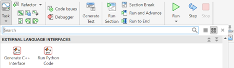

If you click on it, it will add the live task to your Live Script where the cursor is located. Alternatively, you can start typing “python” or “run” directly in your Live Script select the task:

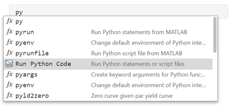

This is what the first version (mine looked like):

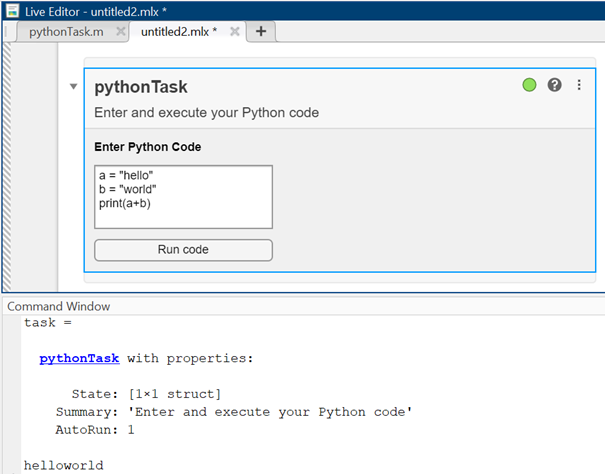

And this is what Lucas turned it into:

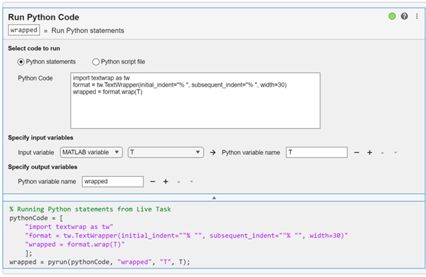

## 4.3. Basic syntax of calling Python from MATLAB

All Python functions calls from MATLAB have the same basic syntax:

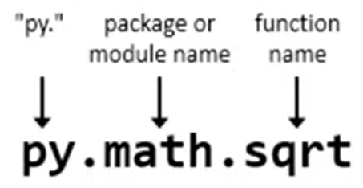

The basic example that I give to kick things off is usually calling the
square root function from the [math module](https://docs.python.org/3/library/math.html), that is part of the
Python standard library. It makes little sense to call mathematics
functions in Python from MATLAB, but it is easy to compare the result
with what you would expect directly from MATLAB:

In the MATLAB Command Window:

`>> py.math.sqrt(42)`

In a MATLAB Live Script:


```matlab
py.math.sqrt(42)
```


```text:Output
ans = 6.4807
```


We can create Python data structures from within MATLAB:


```matlab
py.list([1,2,3])
```


```text:Output
ans = 
  Python list with values:

    [1.0, 2.0, 3.0]

    Use string, double or cell function to convert to a MATLAB array.

```


```matlab
py.list({1,2,'a','b'})
```


```text:Output
ans = 
  Python list with values:

    [1.0, 2.0, 'a', 'b']

    Use string, double or cell function to convert to a MATLAB array.

```


```matlab
s = struct('a', 1, 'b', 2)
```


```text:Output
s = 
    a: 1
    b: 2

```


```matlab
d = py.dict(s)
```


```text:Output
d = 
  Python dict with no properties.

    {'a': 1.0, 'b': 2.0}

```


And we can run methods on those data structures from the MATLAB side:


```matlab
methods(d)
```


```text:Output
Methods for class py.dict:

char        copy        eq          get         items       le          ne          popitem     struct      values      
clear       dict        ge          gt          keys        lt          pop         setdefault  update      

Static methods:

fromkeys    

Methods of py.dict inherited from handle.
```


```matlab
d.get('a')
```


```text:Output
ans = 1
```

## 4.4. Call Python User Defined Functions from MATLAB

In this chapter, we will leverage a demo developed by a colleague of mine, Ian McKenna, who is a principal application engineer specialized in Finance at MathWorks. In this example, he is responsible for building enterprise web predictive analytics that other business critical applications can connect to as a web service. It follows the same structure as the weather example in chapter 2.

This web service is [forecasting the price of cryptocurrencies](https://www.mathworks.com/videos/integrating-python-with-matlab-1605793241650.html ):

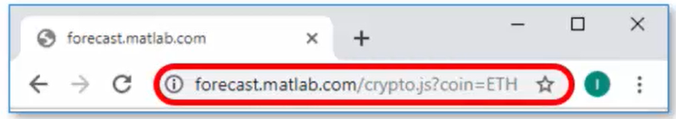

It returns data in the following form (JSON):
```json
[{"Time":"2022-01-21T12:00:00Z","predictedPrice":2466.17},
...
{"Time":"2022-01-21T17:00:00Z","predictedPrice":2442.25}]
```

The first step is to develop an application that simply shows the historical price movement of a particular cryptocurrency:

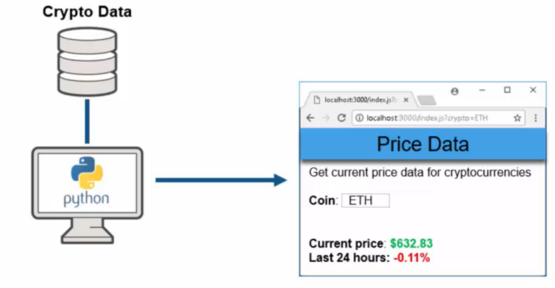

This allows you to monitor the evolution of the price over the last 24
hours and take decisions to buy or sell your crypto assets based on
this. Then one day, you manager comes to you and says:

*“Hey, I have an idea. If we had access to the predicted forward looking
data as opposed to the historical data, we could make additional profit
beyond what we're currently making, even if the prediction is 100%
accurate. “*

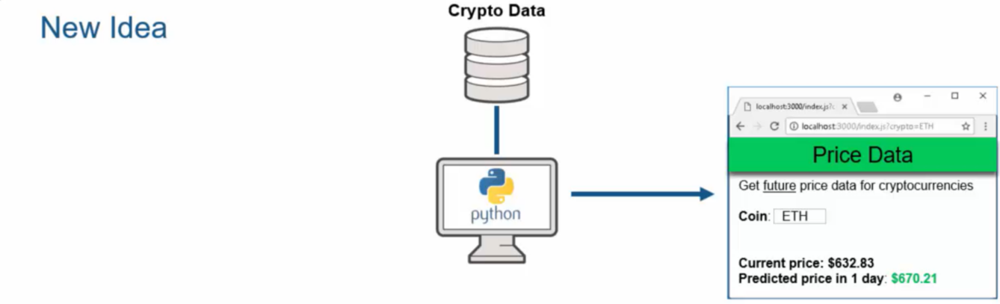

Let’s assume the organization has a few quants that have extensive
MATLAB expertise. And they know exactly how to build out such predictive
models that the business users are looking for.

However, before we can get to that, our first challenge is to call the Python data scraping libraries and pull that data directly into MATLAB. Our first task at hand: Parse the cryptocurrency URL that we are connecting to, and just get out the domain name. For that, we want to use this function that's contained within the Python standard libraries and use it from within MATLAB. In this case, we are going to call a package [`urllib`](https://docs.python.org/3/library/urllib.html) . It contains a sub-module called `parse`, that contains in turn the function `urlparse`.


```matlab
startDate = '2022-01-21T12:00:00Z';
stopDate = '2022-01-21T17:00:00Z';
url = "https://api.pro.coinbase.com/products/ETH-USD/candles?start="+startDate+"&end="+stopDate+"&granularity=60"
```


```text:Output
url = "https://api.pro.coinbase.com/products/ETH-USD/candles?start=2022-01-21T12:00:00Z&end=2022-01-21T17:00:00Z&granularity=60"
```


```matlab
urlparts = py.urllib.parse.urlparse(url)
```


```text:Output
urlparts = 
  Python ParseResult with properties:

    fragment
    hostname
    netloc
    params
    password
    path
    port
    query
    scheme
    username

    ParseResult(scheme='https', netloc='api.pro.coinbase.com', path='/products/ETH-USD/candles', params='', query='start=2022-01-21T12:00:00Z&end=2022-01-21T17:00:00Z&granularity=60', fragment='')

```


```matlab
domain = urlparts.netloc
```


```text:Output
domain = 
  Python str with no properties.

    api.pro.coinbase.com

```


To avoid the unnecessary back and forth of intermediate data between MATLAB and Python, we write a [Python User Defined Module](https://www.mathworks.com/help/matlab/matlab_external/call-user-defined-custom-module.html), called `dataLib.py` with a few functions in it:


```matlab(Display)
jsonData = py.dataLib.getPriceData("ETH", startDate, stopDate)
data = py.dataLib.parseJson(jsonData, [0,4])
```


`dataLib.py` imports 1-minute bars from [Coinbase Pro](https://pro.coinbase.com/).  Note, the API does not fetch the first minute specified by the start date so the times span (start, stop]. To return data we are using a variety of data structures from Numpy arrays to lists and dictionaries, and even JSON.


This is how you would call this function from MATLAB.


Note: dataLib.py must be on Python's path


```matlab
product = "ETH"
```


```text:Output
product = "ETH"
```


```matlab
startDate = '2022-01-21T12:00:00Z';
stopDate = '2022-01-21T17:00:00Z';
jsonData = py.dataLib.getPriceData(product, startDate, stopDate);
```


If you want to add interactivity to your Live Script, you can add so called [Live Controls](https://www.mathworks.com/help/matlab/matlab_prog/add-interactive-controls-to-a-live-script.html). This is helpful to point other people to areas where you may want to change parameters or select things to do scenario analysis. 


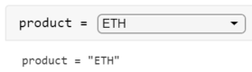

You can insert controls from the ribbon:

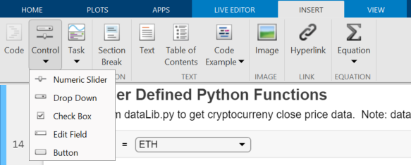

This is how you would parametrize the Live Control:

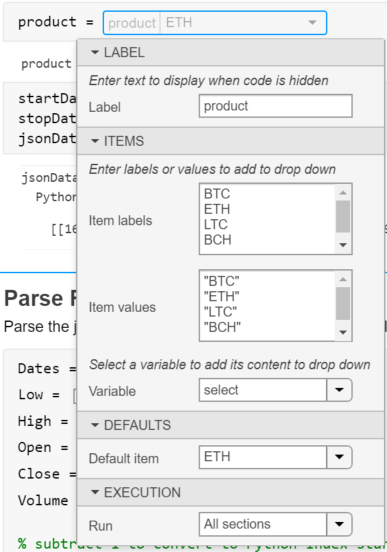

Another type of Live Control that is useful here are simple checkboxes
to select the information we want to return from the parseJson function:


Another type of Live Control that is useful here are simple checkboxes to select the information we want to return from the `parseJson` function:

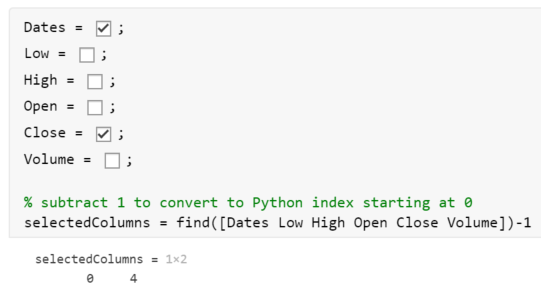

```matlab
Dates = true;
Low = false;
High = false;
Open = false;
Close = true;
Volume = false;

% subtract 1 to convert to Python index starting at 0
selectedColumns = find([Dates Low High Open Close Volume])-1
```


```text:Output
selectedColumns = 1x2    
     0     4

```


Pay attention to the fact that we are subtracting 1 to the resulting array to adapt to Python indexing starting at 0.


```matlab
% this function returns back two outputs as a tuple
data = py.dataLib.parseJson(jsonData, selectedColumns);
```


The last thing we will do in this part of the story is to convert the Python function outputs do MATLAB Data types (this will be covered in the last section of this chapter on mapping data between Python and MATLAB).


```matlab
priceData = data{1}
```


```text:Output
priceData = 
  Python ndarray:

   1.0e+09 *

    1.6428    0.0000
    1.6428    0.0000
    ...
    1.6428    0.0000
    1.6428    0.0000

    Use details function to view the properties of the Python object.

    Use double function to convert to a MATLAB array.

```


Use details function to view the properties of the Python object.

Use double function to convert to a MATLAB array.

```matlab
columnNames = data{2}
```


```text:Output
columnNames = 
  Python list with no properties.

    ['Date', 'Close']

```


Then we can cast over the Numpy array on the right-hand side by just using the double command:


```matlab
priceData = double(priceData)
```


```text:Output
priceData = 300x2    
1.0e+09 *

    1.6428    0.0000
    1.6428    0.0000
    1.6428    0.0000
    1.6428    0.0000
    1.6428    0.0000
    1.6428    0.0000
    1.6428    0.0000
    1.6428    0.0000
    1.6428    0.0000
    1.6428    0.0000

```


Likewise, we have a variety of commands for casting lists like string (or cell before R2022a):


```matlab
columnNames = string(columnNames);
```


Once we have those data in MATLAB, we will convert it over to the MATLAB table, which is basically equivalent to Pandas data frames:


```matlab
data = array2table(priceData, 'VariableNames', columnNames);
```


Like tables, timetable are built-in data constructs that appeared in MATLAB over the last couple of years to make our lives easy for doing simple types of tasks or even complex types of tasks. If I want to deal with time zones and convert the times – which are with respect to universal time zone – to a view of someone who is in New York, the command [datetime](https://www.mathworks.com/help/matlab/ref/datetime.html#d123e298898) allows us to do that conversion:


```matlab
data.Date = datetime(data.Date, 'ConvertFrom', 'posixtime', 'TimeZone', 'America/New_York')
```

| |Date|Close|
|:--:|:--:|:--:|
|1|21-Jan-2022 12:00:00|2.8073e+03|
|2|21-Jan-2022 11:59:00|2.8108e+03|
|3|21-Jan-2022 11:58:00|2.8051e+03|
|4|21-Jan-2022 11:57:00|2.8071e+03|
|5|21-Jan-2022 11:56:00|2.8051e+03|
|6|21-Jan-2022 11:55:00|2.8028e+03|
|7|21-Jan-2022 11:54:00|2.7984e+03|
|8|21-Jan-2022 11:53:00|2.7983e+03|
|9|21-Jan-2022 11:52:00|2.8062e+03|
|10|21-Jan-2022 11:51:00|2.8054e+03|
|11|21-Jan-2022 11:50:00|2.8061e+03|
|12|21-Jan-2022 11:49:00|2.8012e+03|
|13|21-Jan-2022 11:48:00|2.8008e+03|
|14|21-Jan-2022 11:47:00|2.8030e+03|


```matlab
plot(data.Date, data.Close)
```


[**Reload Modified User-Defined Python Module**](https://www.mathworks.com/help/matlab/matlab_external/call-user-defined-custom-module.html#buuz303) 

What if you’ve made modifications to the functions inside of your `dataLib` module? You call those again from MATLAB, but you don’t see any difference. It is because you need to reload the module:

```matlab
mod = py.importlib.import_module('dataLib');
py.importlib.reload(mod);
```

You may need to unload the module first, by clearing the classes. This will delete all variables, scripts and classes in your MATLAB workspace.

```matlab
clear classes 
```
If you're running Python out-of-process, another approach is to simply [terminate the process](https://www.mathworks.com/help/matlab/matlab_external/reload-python-interpreter.html).


```matlab
terminate(pyenv) 
```

## 4.5. Call Python community packages from MATLAB


In some scientific fields like earth and climate sciences, we observe a growing Python community. But as programming skills may vary a lot in researchers and engineers, a MATLAB interface to Python community packages can open up some domain specific capabilities to the 5M+ MATLAB community.


One great example of this is the [Climate Data Store Toolbox](https://github.com/mathworks/climatedatastore) developed by Rob Purser, a fellow MathWorker. Rob and I are part of the MathWorks Open Source Program. We are promoting open-source, both to support the use of open-source software in MathWorks products and to help for MathWorkers to contribute their work on GitHub and the [MATLAB File Exchange](https://www.mathworks.com/matlabcentral/fileexchange/).


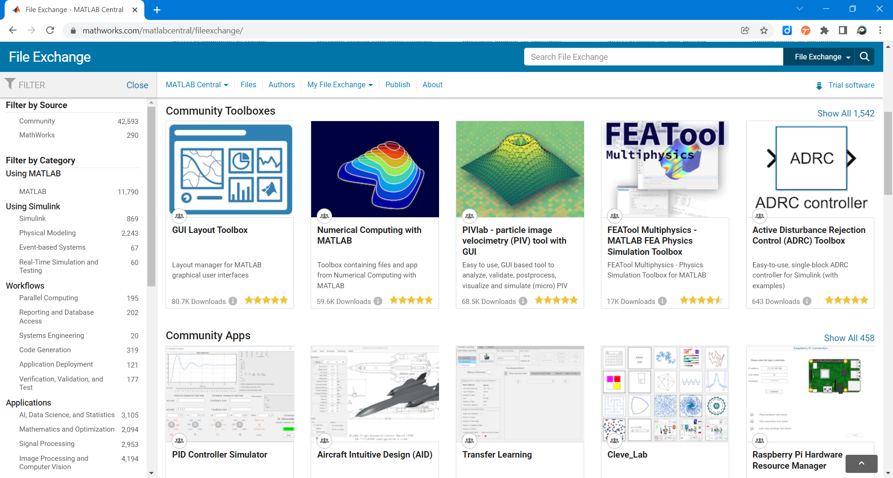

In this section we will demonstrate with the Climate Data Store Toolbox how to build MATLAB toolboxes on top of Python packages. It relies on the [CDS Python API](https://github.com/ecmwf/cdsapi) created by the European Centre for Medium-Range Weather Forecasts (ECMWF). The toolbox will automatically configure Python, download and install the CSAPI package (you can manually do it using `pip install cdsapi`). You will need to create an account on [https://cds.climate.copernicus.eu/](https://cds.climate.copernicus.eu/) to retrieve data.


The first time you use it, it will prompt you for CSAPI credentials. 


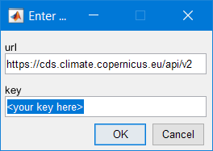


Select the data to download from the dataset (see [this webpage](https://cds.climate.copernicus.eu/cdsapp#!/dataset/satellite-sea-ice-thickness?tab=form) for options). This is a "MATLABized" version of the python structure that is generated in the API request.


```matlab
datasetName ="satellite-sea-ice-thickness";
options.version = "1_0";
options.variable = "all";
options.satellite = "cryosat_2";
options.cdr_type = ["cdr","icdr"]; 
options.year = ["2011","2021"]; 
options.month = "03";
[downloadedFilePaths,citation] = climateDataStoreDownload('satellite-sea-ice-thickness',options);
```


```text:Output
2021-12-03 14:45:47,502 INFO Welcome to the CDS
2021-12-03 14:45:47,504 INFO Sending request to https://cds.climate.copernicus.eu/api/v2/resources/satellite-sea-ice-thickness
2021-12-03 14:45:47,610 INFO Request is completed
2021-12-03 14:45:47,611 INFO Downloading https://download-0012.copernicus-climate.eu/cache-compute-0012/cache/data0/dataset-satellite-sea-ice-thickness-2e9e98de-6daf-4e4e-b54c-6e2d3717bda2.zip to C:\Users\rpurser\AppData\Local\Temp\tp047bab7e_df6a_405a_b357_cda6a03d28f6.zip (4.4M)
2021-12-03 14:45:50,037 INFO Download rate 1.8M/s
```


Once imported with Python, the NetCDF files are read with MATLAB using [ncread](https://www.mathworks.com/help/matlab/ref/ncread.html) and storing information as [timetable](https://www.mathworks.com/help/matlab/timetables.html) with the function [readSatelliteSeeIceThickness](https://github.com/mathworks/climatedatastore/blob/main/doc/readSatelliteSeaIceThickness.m):


```matlab
ice2011 = readSatelliteSeaIceThickness("satellite-sea-ice-thickness\ice_thickness_nh_ease2-250_cdr-v1p0_201103.nc");
ice2021 = readSatelliteSeaIceThickness("satellite-sea-ice-thickness\ice_thickness_nh_ease2-250_icdr-v1p0_202103.nc");
head(ice2021)
```

| |time|lat|lon|thickness|
|:--:|:--:|:--:|:--:|:--:|
|1|01-Mar-2021|47.6290|144.0296|2.4566|
|2|01-Mar-2021|47.9655|144.0990|2.5800|
|3|01-Mar-2021|50.5072|148.0122|-0.0364|
|4|01-Mar-2021|50.8360|148.1187|1.0242|
|5|01-Mar-2021|50.3237|146.9969|0.0518|
|6|01-Mar-2021|51.1642|148.2269|0.2445|
|7|01-Mar-2021|50.9112|147.6573|0.8933|
|8|01-Mar-2021|50.6540|147.0948|0.1271|


```matlab
disp(citation)
```


```text:Output
Generated using Copernicus Climate Change Service information 2021
```


This toolbox leverages the beautiful [geoplotting](https://www.mathworks.com/help/matlab/ref/geodensityplot.html) capabilities of MATLAB:


```matlab
subplot(1,2,1)
geodensityplot(ice2011.lat,ice2011.lon,ice2011.thickness,"FaceColor","interp")
geolimits([23 85],[-181.4 16.4])
geobasemap("grayterrain")
title("Ice Thickness, March 2011")

subplot(1,2,2)
geodensityplot(ice2021.lat,ice2021.lon,ice2021.thickness,"FaceColor","interp")
geolimits([23 85],[-181.4 16.4])
geobasemap("grayterrain")
title("Ice Thickness, March 2021")
f = gcf;
f.Position(3) = f.Position(3)*2;
```


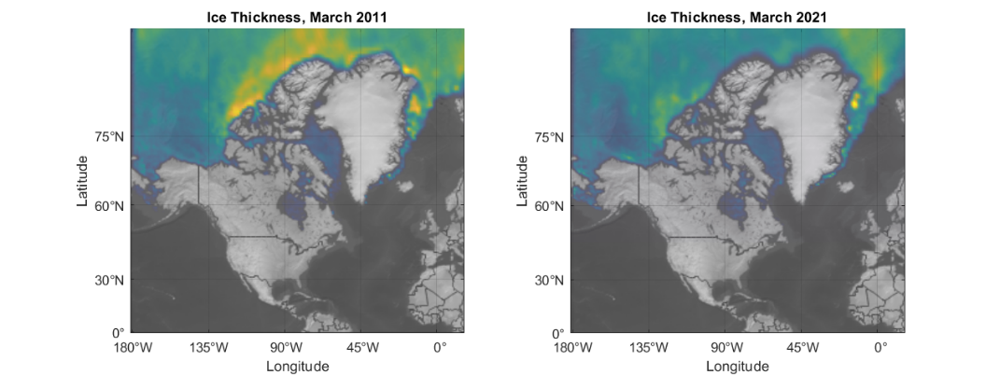


In a well written toolbox like this one, you find a documentation that is packaged directly with it.


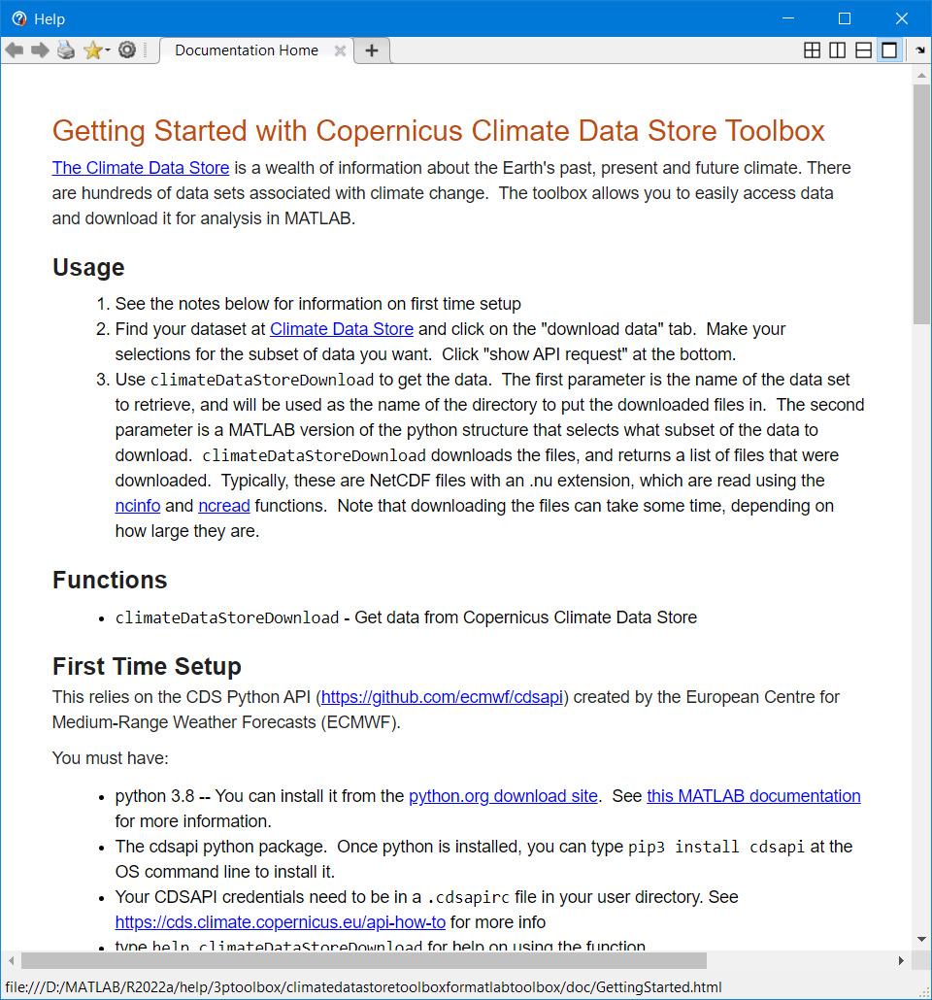


You can create your own toolbox and share it with others. These files can include MATLAB code, data, apps, examples, and documentation. When you create a toolbox, MATLAB generates a single installation file (.mltbx) that enables you or others to install your toolbox.


Read more on how to [create and share toolboxes](https://www.mathworks.com/help/matlab/matlab_prog/create-and-share-custom-matlab-toolboxes.html)


## 4.6. Debug Python code called by MATLAB


One of the first difficulty you will face when developing bilingual
applications, is debugging across the language boundary. In the
following examples we will demonstrate how to attach a MATLAB session to
a VSCode or Visual Studio process to debug the Python part of your app.
In the next chapter, we will see how to do the opposite, debug the
MATLAB part with the nice MATLAB Debugger.

### 4.6.1. Debug with Visual Studio Code

This section is showing in 8 steps [how to debug Python code called from MATLAB with VSCode](https://www.mathworks.com/matlabcentral/answers/1645680-how-can-i-debug-python-code-using-matlab-s-python-interface-and-visual-studio-code):

1. Install VS Code and create a project.

See this [tutorial](https://code.visualstudio.com/docs/python/python-tutorial#_configure-and-run-the-debugger) for instructions on how to install Visual Studio Code, set up a Python project, select a Python interpreter, and create a `launch.json` file.

2. In a terminal, install the debugpy module using, for example,
```
$ python -m pip install debugpy
```
3. In VS Code, add the following debugging code to the top of your Python module.
```python
import debugpy
debugpy.debug_this_thread()
```
4. Configure the launch.json file to select and attach to MATLAB using
the code below.
```json
{
    "version": "0.2.0",
    "configurations": [
         {  
            "name": "Attach to MATLAB",
            "type": "python",
            "request": "attach",
            "processId": "${command:pickProcess}"
         }
    ]
}
```
5. Add breakpoints to your code.

6. Set up your Python environment in MATLAB and get the ProcessID number. In this example, the `ExecutionMode` is set to `InProcess`.
```matlab
>> pyenv 

ans = 
  PythonEnvironment with properties:

          Version: "3.8"
       Executable: "C:\Users\ydebray\AppData\Local\Programs\Python\Python38\python.exe"
          Library: "C:\Users\ydebray\AppData\Local\Programs\Python\Python38\python38.dll"
             Home: "C:\Users\ydebray\AppData\Local\Programs\Python\Python38"
           Status: Loaded
    ExecutionMode: InProcess
        ProcessID: "12772"
      ProcessName: "MATLAB"

```


If you see `Status: NotLoaded`, execute any Python command to load the Python interpreter (for example  `>> py.list` ) then execute the `pyenv` command to get the `ProcessID` for the MATLAB process.

7. Attach the MATLAB process to VS Code.

In VS Code, select "Run and Debug" (Ctrl+Shift+D), then select the arrow to Start Debugging (F5). In this example, the green arrow has the label "Attach to MATLAB". Note that this corresponds to the value of the "name" parameter that you specified in the `launch.json` file. Type "matlab" in the search bar of the dropdown menu and select the "MATLAB.exe" process that matches the ProcessID from the output of the pyenv command. Note that if you are using OutOfProcess execution mode, you will need to search for a "MATLABPyHost.exe" process.

**In-process:**

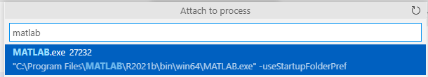

**Out-of-Process:**

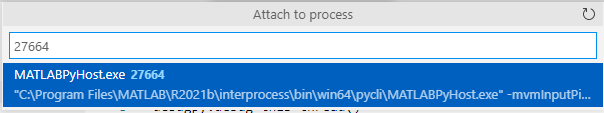

8. Invoke the Python function from MATLAB. Execution should stop at the
breakpoint.

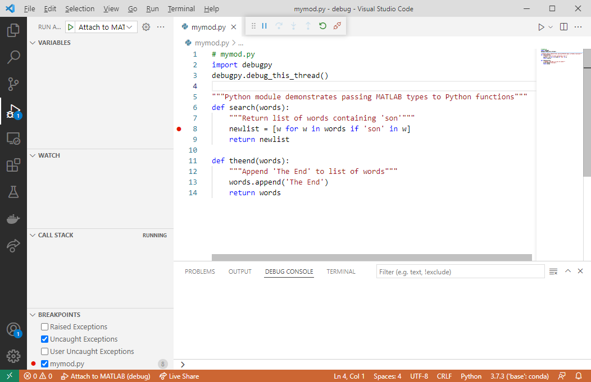

Run the following MATLAB code to step into the Python function search:
```matlab
>> N = py.list({'Jones','Johnson','James'})
>> py.mymod.search(N)
```

### 4.6.2. Debug with Visual Studio

If you have access to Visual Studio and you are more familiar with it, you can do the same as before with [Visual Studio](https://stackoverflow.com/questions/61708900/calling-python-from-matlab-how-to-debug-python-code). Open Visual Studio and create a new Python project from existing code. Then, select Attach to Process from the Debug menu:

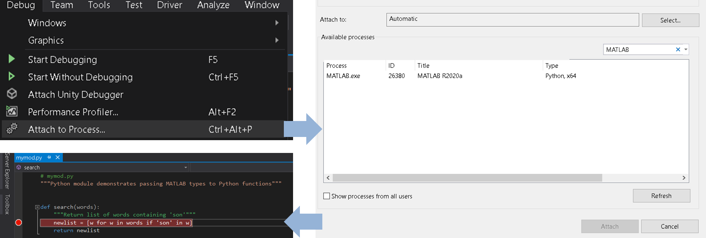

# 4.7. Mapping data between Python and MATLAB


In his book about [*Python for MATLAB Development*](https://link.springer.com/book/10.1007/978-1-4842-7223-7), Albert Danial shares some clever functions to convert MATLAB variables into an equivalent Python-native variable with [mat2py](https://github.com/Apress/python-for-matlab-development/blob/main/code/matlab_py/mat2py.m), and vice-versa with [py2mat](https://github.com/Apress/python-for-matlab-development/blob/main/code/matlab_py/py2mat.m).


[Converting data](https://www.mathworks.com/help/matlab/matlab_external/passing-data-to-python.html) returned by Python function inside of MATLAB may require understanding some of the differences in the native datatypes of the two languages:


   -  Scalars (integers, floating point numbers, …), text and Booleans 
   -  Dictionaries and lists 
   -  Arrays and dataframes 


Some specialized MATLAB data types like *timetable* or *categorical* will require some extra love and need to be converted manually. Of course, we can still use these data types in our functions, but the functions need to return types that the Python interpreter can understand.


## 4.7.1. Scalars


The table below shows the mappings for common scalar data types:


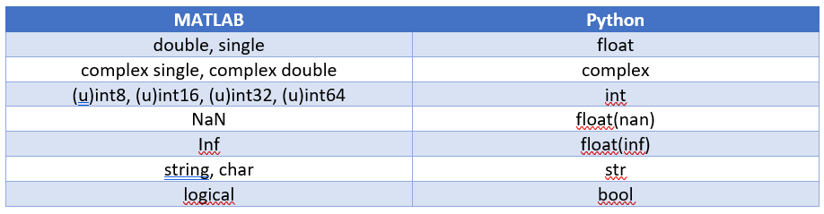


By default, numbers in MATLAB are double, whereas numbers without decimal point in Python are integers.


```matlab
a = py.dataExchange.get_float()
```


```text:Output
a = 1
```


```matlab
class(a)
```


```text:Output
ans = 'double'
```


```matlab
b = py.dataExchange.get_complex()
```


```text:Output
b = 2.0000 + 0.0000i
```


```matlab
class(b)
```


```text:Output
ans = 'double'
```


There are several kinds of integers in MATLAB, depending on the precision you require. 


For instance [uint8](https://www.mathworks.com/help/matlab/ref/uint8.html) can only store positive numbers between 0 and 255, whereas [int8](https://www.mathworks.com/help/matlab/ref/int8.html) covers the range [-2^7,2^7-1].


The most generic type to convert Python integers are int64, which you can do explicitly.


```matlab
c = py.dataExchange.get_integer()
```


```text:Output
c = 
  Python int with properties:

    denominator: [1x1 py.int]
           imag: [1x1 py.int]
      numerator: [1x1 py.int]
           real: [1x1 py.int]

    3

```


```matlab
class(c)
```


```text:Output
ans = 'py.int'
```


```matlab
int64(c)
```


```text:Output
ans = 3
```


When getting a string from a Python function, the convertion isn't obvious. It can either be turned into a [char](https://www.mathworks.com/help/matlab/ref/char.html) (character array) or a [string](https://www.mathworks.com/help/matlab/ref/string.html).


You can distinguish them by the single quotation marks for chars, and double quotes for strings.


```matlab
abc = py.dataExchange.get_string()
```


```text:Output
abc = 
  Python str with no properties.

    abc

```


```matlab
char(abc)
```


```text:Output
ans = 'abc'
```


```matlab
class(char(abc))
```


```text:Output
ans = 'char'
```


```matlab
string(abc)
```


```text:Output
ans = "abc"
```


```matlab
class(string(abc))
```


```text:Output
ans = 'string'
```


Finally, the last basic datatype that contains a logical information is called a boolean in Python:


```matlab
py.dataExchange.get_boolean()
```


```text:Output
ans = 
   1

```

## 4.7.2. Dictionaries and Lists

This is how containers map to each other between the two languages:


To illustrate the conversion of Python dictionaries and lists into MATLAB containers, we will reuse the example from chapter 2.


JSON data are really close to dictionaries in Python, which makes the data processing very easy when accessing data from web services.


```matlab
url = webread("https://samples.openweathermap.org").products.current_weather.samples{1};
r = py.urllib.request.urlopen(url).read();
json_data = py.json.loads(r);
py.weather.parse_current_json(json_data)
```


```text:Output
ans = 
  Python dict with no properties.

    {'temp': 280.32, 'pressure': 1012, 'humidity': 81, 'temp_min': 279.15, 'temp_max': 281.15, 'speed': 4.1, 'deg': 80, 'lon': -0.13, 'lat': 51.51, 'city': 'London', 'current_time': '2022-05-22 22:15:18.161296'}

```


Dictionaries can contain scalars, but also other datatypes like lists.


```matlab
url2 = webread("https://samples.openweathermap.org").products.forecast_5days.samples{1};
r2 = py.urllib.request.urlopen(url2).read();
json_data2 = py.json.loads(r2);
forecast = struct(py.weather.parse_forecast_json(json_data2))
```


```text:Output
forecast = 
    current_time: [1x40 py.list]
            temp: [1x40 py.list]
             deg: [1x40 py.list]
           speed: [1x40 py.list]
        humidity: [1x40 py.list]
        pressure: [1x40 py.list]

```


```matlab
forecastTemp = forecast.temp;
forecastTime = forecast.current_time;
```


Lists containing only numeric data can be converted into doubles since MATLAB R2022a:


```matlab
double(forecastTemp)
```


```text:Output
ans = 1x40    
  261.4500  261.4100  261.7600  261.4600  260.9810  262.3080  263.7600  264.1820  264.6700  265.4360  266.1040  266.9040  268.1020  270.2690  270.5850  269.6610  269.1550  268.0560  265.8030  263.3810  261.8500  263.4550  264.0150  259.6840  255.1880  255.5940  256.9600  258.1090  259.5330  263.4380  264.2280  261.1530  258.8180  257.2180  255.7820  254.8190  257.4880  259.8270  261.2560  260.2600

```


And any lists can be converted to string (even those containing a mix of text and numeric data).


```matlab
forecastTimeString = string(forecastTime);
datetime(forecastTimeString)
```


```text:Output
ans = 1x40 datetime    
30-Jan-2017 18:00:0030-Jan-2017 21:00:0031-Jan-2017 00:00:0031-Jan-2017 03:00:0031-Jan-2017 06:00:0031-Jan-2017 09:00:0031-Jan-2017 12:00:0031-Jan-2017 15:00:0031-Jan-2017 18:00:0031-Jan-2017 21:00:0001-Feb-2017 00:00:0001-Feb-2017 03:00:0001-Feb-2017 06:00:0001-Feb-2017 09:00:0001-Feb-2017 12:00:0001-Feb-2017 15:00:0001-Feb-2017 18:00:0001-Feb-2017 21:00:0002-Feb-2017 00:00:0002-Feb-2017 03:00:0002-Feb-2017 06:00:0002-Feb-2017 09:00:0002-Feb-2017 12:00:0002-Feb-2017 15:00:0002-Feb-2017 18:00:0002-Feb-2017 21:00:0003-Feb-2017 00:00:0003-Feb-2017 03:00:0003-Feb-2017 06:00:0003-Feb-2017 09:00:00

```


Before MATLAB R2022a, Python lists need to be converted into [MATLAB cell arrays](https://www.mathworks.com/help/matlab/cell-arrays.html).


Cells can then be transformed to double, strings, with the [cellfun](https://www.mathworks.com/help/matlab/ref/cellfun.html) function.


The previous code would look like this until R2021b:


```matlab
forecastTempCell = cell(forecastTemp)
```

| |1|2|3|4|5|6|7|8|9|10|11|12|13|14|15|16|17|18|19|20|21|22|23|24|25|26|27|28|29|30|
|:--:|:--:|:--:|:--:|:--:|:--:|:--:|:--:|:--:|:--:|:--:|:--:|:--:|:--:|:--:|:--:|:--:|:--:|:--:|:--:|:--:|:--:|:--:|:--:|:--:|:--:|:--:|:--:|:--:|:--:|:--:|
|1|261.4500|261.4100|261.7600|261.4600|260.9810|262.3080|263.7600|264.1820|264.6700|265.4360|266.1040|266.9040|268.1020|270.2690|270.5850|269.6610|269.1550|268.0560|265.8030|263.3810|261.8500|263.4550|264.0150|259.6840|255.1880|255.5940|256.9600|258.1090|259.5330|263.4380|


```matlab
cellfun(@double,forecastTempCell)
```


```text:Output
ans = 1x40    
  261.4500  261.4100  261.7600  261.4600  260.9810  262.3080  263.7600  264.1820  264.6700  265.4360  266.1040  266.9040  268.1020  270.2690  270.5850  269.6610  269.1550  268.0560  265.8030  263.3810  261.8500  263.4550  264.0150  259.6840  255.1880  255.5940  256.9600  258.1090  259.5330  263.4380  264.2280  261.1530  258.8180  257.2180  255.7820  254.8190  257.4880  259.8270  261.2560  260.2600

```


```matlab
forecastTimeCell = cell(forecastTime)
```

| |1|2|3|4|5|6|7|8|9|10|11|12|13|14|15|16|17|18|19|20|21|22|23|24|25|26|27|28|29|30|
|:--:|:--:|:--:|:--:|:--:|:--:|:--:|:--:|:--:|:--:|:--:|:--:|:--:|:--:|:--:|:--:|:--:|:--:|:--:|:--:|:--:|:--:|:--:|:--:|:--:|:--:|:--:|:--:|:--:|:--:|:--:|
|1|1x19 str|1x19 str|1x19 str|1x19 str|1x19 str|1x19 str|1x19 str|1x19 str|1x19 str|1x19 str|1x19 str|1x19 str|1x19 str|1x19 str|1x19 str|1x19 str|1x19 str|1x19 str|1x19 str|1x19 str|1x19 str|1x19 str|1x19 str|1x19 str|1x19 str|1x19 str|1x19 str|1x19 str|1x19 str|1x19 str|


```matlab
cellfun(@string,forecastTimeCell)
```


```text:Output
ans = 1x40 string    
"2017-01-30 18:0…  "2017-01-30 21:0…  "2017-01-31 00:0…  "2017-01-31 03:0…  "2017-01-31 06:0…  "2017-01-31 09:0…  "2017-01-31 12:0…  "2017-01-31 15:0…  "2017-01-31 18:0…  "2017-01-31 21:0…  "2017-02-01 00:0…  "2017-02-01 03:0…  "2017-02-01 06:0…  "2017-02-01 09:0…  "2017-02-01 12:0…  "2017-02-01 15:0…  "2017-02-01 18:0…  "2017-02-01 21:0…  "2017-02-02 00:0…  "2017-02-02 03:0…  "2017-02-02 06:0…  "2017-02-02 09:0…  "2017-02-02 12:0…  "2017-02-02 15:0…  "2017-02-02 18:0…  "2017-02-02 21:0…  "2017-02-03 00:0…  "2017-02-03 03:0…  "2017-02-03 06:0…  "2017-02-03 09:0…  

```

## 4.7.3. Arrrays


By modifying the parse_forecast_json function in the weather module, we can output [Python arrays](https://docs.python.org/3/library/array.html) instead of lists.


There exists indeed a native array datatype in base Python.


```matlab
forecast2 = struct(py.weather.parse_forecast_json2(json_data2))
```


```text:Output
forecast2 = 
    current_time: [1x40 py.list]
            temp: [1x1 py.array.array]
             deg: [1x1 py.array.array]
           speed: [1x1 py.array.array]
        humidity: [1x1 py.array.array]
        pressure: [1x1 py.array.array]

```


The MATLAB double function will convert the Python array into a MATLAB array 


```matlab
double(forecast2.temp)
```


```text:Output
ans = 1x40    
  261.4500  261.4100  261.7600  261.4600  260.9810  262.3080  263.7600  264.1820  264.6700  265.4360  266.1040  266.9040  268.1020  270.2690  270.5850  269.6610  269.1550  268.0560  265.8030  263.3810  261.8500  263.4550  264.0150  259.6840  255.1880  255.5940  256.9600  258.1090  259.5330  263.4380  264.2280  261.1530  258.8180  257.2180  255.7820  254.8190  257.4880  259.8270  261.2560  260.2600

```


Those data conversion also apply to Numpy arrays:


```matlab
npA = py.numpy.array([1,2,3;4,5,6;7,8,9])
```


```text:Output
npA = 
  Python ndarray:

     1     2     3
     4     5     6
     7     8     9

    Use details function to view the properties of the Python object.

    Use double function to convert to a MATLAB array.

```


```matlab
double(npA)
```


```text:Output
ans = 3x3    
     1     2     3
     4     5     6
     7     8     9

```

## 4.7.4. Dataframes


One common question on data transfer, is how to exchange data between MATLAB tables and Pandas Dataframes. The recommended solution for that is to rely on [Parquet files](https://www.mathworks.com/help/matlab/parquet-files.html). Parquet is a columnar storage format that enables to store \& transfer tabular data between languages. It is available to any project in the Hadoop big data ecosystem, regardless of the choice of data processing framework, data model or programming language (more on [Parquet](https://parquet.apache.org/)).


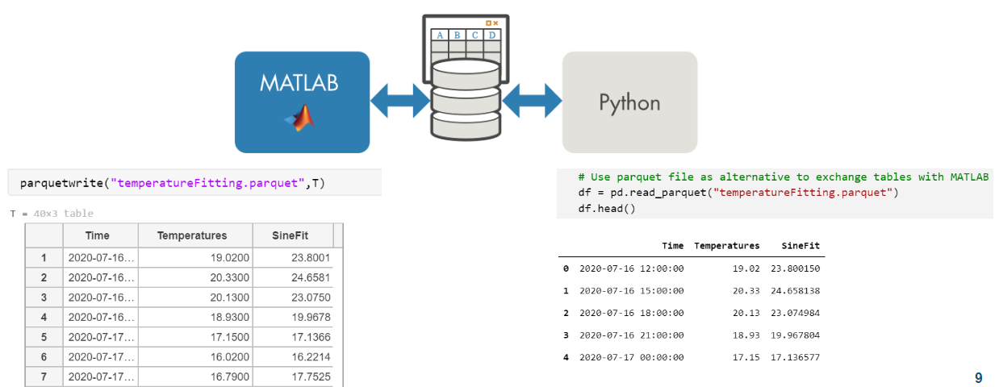


This example demonstrates a back and forth between Pandas DataFrames and MATLAB Tables:


**pq_CreateDataFrame.py**


```python
import pandas as pd
import numpy as np
 
# create dataframe
df = pd.DataFrame({'column1': [-1, np.nan, 2.5], 
'column2': ['foo', 'bar', 'tree'], 
'column3': [True, False, True]})
print(df)
 
# save dataframe to parquet file via pyarrow library
df.to_parquet('data.parquet', index=False)
```

  


Read in parquet file


```matlab
% info = parquetinfo('data.parquet')
data = parquetread('data.parquet')
```

| |column1|column2|column3|
|:--:|:--:|:--:|:--:|
|1|-1|"foo"|1|
|2|NaN|"bar"|0|
|3|2.5000|"tree"|1|


Examine datatype of a particular column


```matlab
class(data.column2)
```


```text:Output
ans = 'string'
```


Change data in table


```matlab
data.column2 = ["orange"; "apple"; "banana"];
```


Write the results back to parquet


```matlab
parquetwrite('newdata.parquet', data)
```


Finally read the modified DataFrame back in Python:


**pq_ReadTable.py**


```python
import pandas as pd
import os 

# change to current directory
thisDirectory = os.path.dirname(os.path.realpath(__file__))
os.chdir(thisDirectory)
# read parquet file via pyarrow library
df = pd.read_parquet('newdata.parquet')
print(df)
```

