# 7. Simulink with Python

Simulink is a software based on MATLAB that enables the modeling,
simulation and generation of code for physical and control systems. It
is heavily used in the development of embedded systems, in applications
such as automotive vehicle dynamics or flight control.

At the [MATLAB Expo 2023](https://www.mathworks.com/videos/using-simulink-with-python-1683218506123.html), my colleague Weiwu and I looked at 4
typical scenarios we observe where Simulink is used with Python. In
those scenarios, Weiwu is representing the Simulink usage, and I'm
representing the Python usage (bearing in mind that in some cases they
are the same users).

The 4 scenarios explored in this chapter:

-   Bring Python code into Simulink as a library for co-execution

-   Integrate TensorFlow and PyTorch models for both simulation and code
    generation

-   Simulate a Simulink model directly from Python

-   Export a Simulink model as a Python package for deployment

## 7.1. Bring Python code into Simulink as a library for co-execution

In the first scenario, an algorithm has been developed for computer
vision using Python, and it needs to be integrated into a larger system
for simulation.

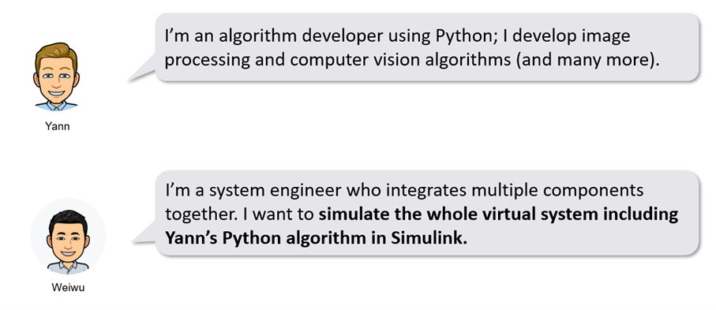

### 7.1.1. Python Importer for Simulink 

In Simulink 23a, we shipped a new feature called the Python Importer. It
can help you to bring your Python function in the Simulink as a library
block easily. It provides a graphical wizard for step-by-step guidance.
In this demo, we will use a [Python Human Detector algorithm calling
OpenCV from Python](https://github.com/mathworks/Integrate_Python_code_with_Simulink).

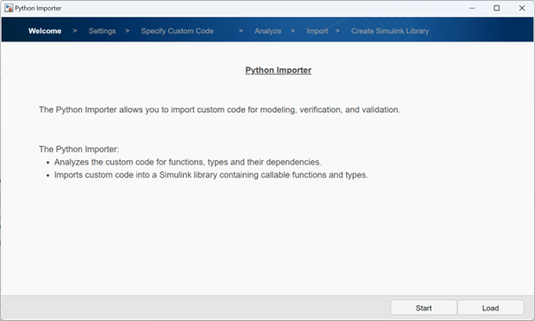

The importer will walk you through the following steps:

Welcome \> Settings \> Specify Custom Code \> Analyze \> Import \>
Create Simulink Library

The Python Importer allows you to import custom code for modeling,
verification, and validation.

The Python Importer:

-   Analyzes the custom code for functions, types and their
    dependencies.

-   Imports custom code into a Simulink library containing callable
    functions and types.

**Settings**

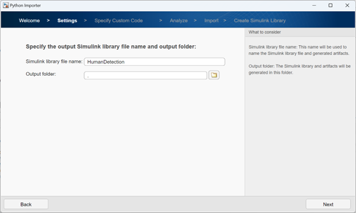

**Specify Custom Code**

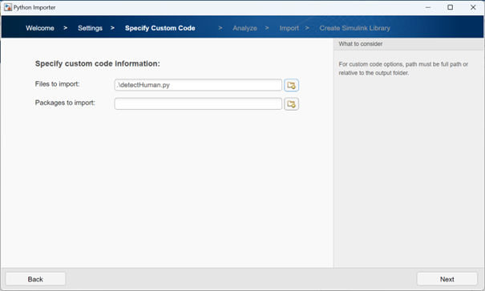

**Analyze**

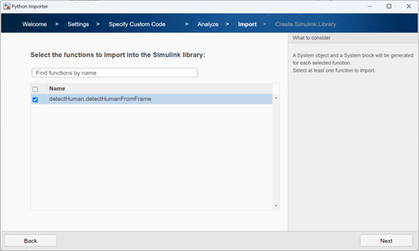

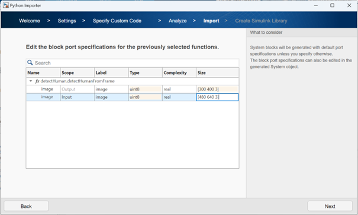

The library is created and can be drag and dropped into a new diagram.

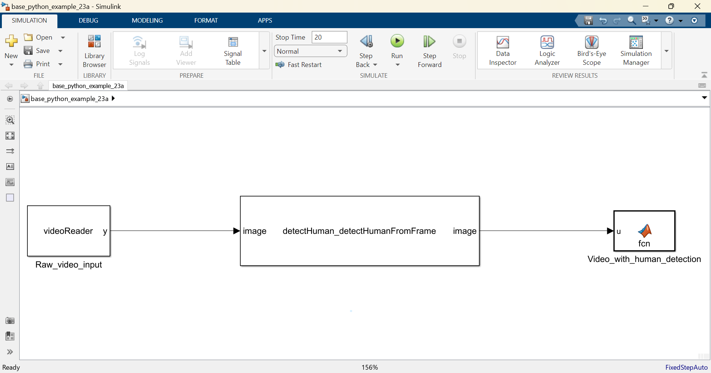

### 7.1.2. MATLAB function and system objects


Prior to 23a, you had two different ways of calling Python from within a Simulink block:
-	Using a MATLAB function 
-	Using a MATLAB system object 
 
In both cases you are wrapping the Python code with the `py.` prefix.


The first option is with a [MATLAB Function](https://www.mathworks.com/help/simulink/slref/matlabfunction.html). The only trick is the [`coder.extrinsic`](https://www.mathworks.com/help/simulink/slref/coder.extrinsic.html)  function that specifies to explicitly call MATLAB and not generate code for the Simulink simulation.
If you double click on the block, you can see this code:
```matlab
function y = fcn(u)
    coder.extrinsic('py.detectHuman.getHogObject')
    coder.extrinsic('py.detectHuman.detectHumanFromFrame')
    
    persistent hog;
    if isempty(hog)
        hog = py.detectHuman.getHogObject();
    end
    
    out = py.detectHuman.detectHumanFromFrame(u, hog);
    
    y = uint8(out);
end
```

The second option is with a [MATLAB System](https://www.mathworks.com/help/simulink/slref/matlabsystem.html) block. You need to set it up to *“Simulate using: Interpreted execution”*. In both of those options, you cannot generate the code for Python.

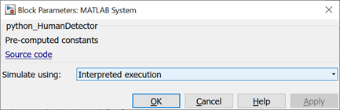

The source code for this MATLAB System follows the paradigm of [Object-Oriented Programming](https://www.mathworks.com/products/matlab/object-oriented-programming.html):

```matlab
classdef python_HumanDetector < matlab.System
    % Pre-computed constants
    properties(Access = private, Nontunable)
        hog
    end

    methods(Access = protected)
        function setupImpl(obj)
            % Perform one-time calculations, such as computing constants
            obj.hog = py.detectHuman.getHogObject();
        end

        function y = stepImpl(obj,u)
            % Calculate y as a function of input u and discrete states.
            out = py.detectHuman.detectHumanFromFrame(u, obj.hog);
            y = uint8(out);
        end

        function out = getOutputSizeImpl(obj)
            out = [300 400 3];
        end
        
        function y1 = getOutputDataTypeImpl(obj)
            y1 = 'uint8';
        end
        
        function y1 = isOutputComplexImpl(~)
            y1 = false;
        end
        
        function out = isOutputFixedSizeImpl(obj)
            out = true;
        end

    end
end
```

The limitation with this approach is that you cannot generate code for embedded systems. 

## 7.2. Integrate TensorFlow and PyTorch models for both simulation and code generation

In the second scenario, an AI deep learning model has been developed
with TensorFlow or PyTorch, and it needs not only to be simulated with
the whole system, but the code for AI model needs to be generated in
order to be integrated into an embedded system.

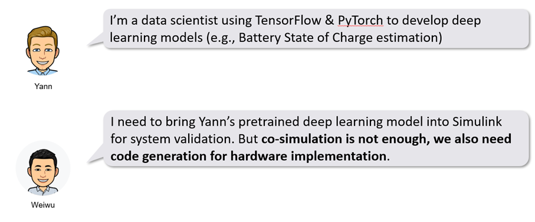

One example of this workflow was presented by MBDA at the [MATLAB UK Expo
2023](https://www.mathworks.com/videos/integrating-ai-into-simulink-for-simulation-and-deployment-1699640610671.html).

Before we dive in, there are two options to integrate a python AI model into Simulink if code generation is a must have. The first one is importing the deep learning model in MATLAB directly with the Deep Learning Toolbox. And the second one is to simulate and generate code using TensorFlow Lite. The plus and delta for those two approaches are the following:
Those are library-free C and C++ code, some optimized code for Intel and ARM processor, and CUDA code for GPUs. The delta is, in this case, that the input process can sometimes be painful. And there's a bit of a need of custom code and manual validation testing.
-	Import your deep learning model in MATLAB directly
    
    (+) Multi-platform code generation: library-free C/C++ code, optimized code for Intel and ARM processors, and CUDA code for NVIDIA® GPU
    
    (∆) import process can be painful, need for custom code, and validation testing

-	Integrate deep learning models from TensorFlow Lite (TFLite)
    
    (+) requiring only a simple Python code to compile the model
    
    (∆) requires the TensorFlow Lite interpreter and libraries built on the target hardware, which is currently limited to Windows and Linux targets

### 7.2.1.	Import your deep learning model in MATLAB directly

You can convert models from TensorFlow, PyTorch, and ONNX into MATLAB. Once the model is converted in MATLAB, you can use the deep neural networks blocks to bring it in Simulink for both simulation and code generation.

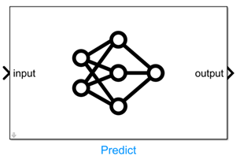

Let us use a TensorFlow model to [predict the state of charge of a battery](https://www.mathworks.com/videos/integrate-tensorflow-model-into-simulink-for-simulation-and-code-generation-1649142078929.html), and generate C-code to be integrated in the battery management system.

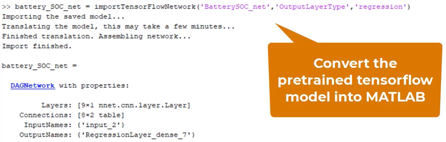

You can visualize the model with the deep network designer, in order to understand what the imported network looks like.

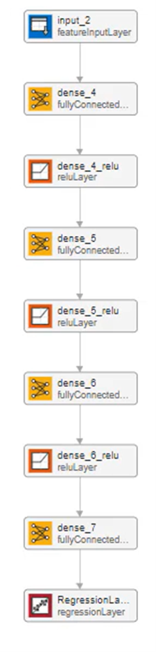

Then save the imported model as a .mat file and load it in a Simulink block.

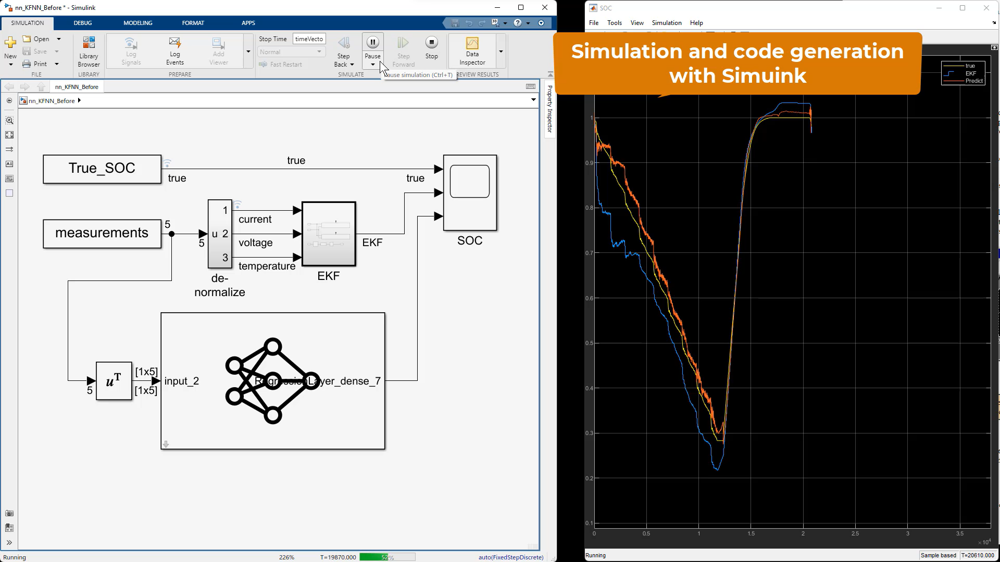

Another use case for the integration of Python AI models into Simulink is the replacement of a control system or a physical system by a reduced model of this system.

### 7.2.2.	Integrate deep learning models from TensorFlow Lite (TFLite) 

In the scenario of a TensorFlow user willing to integrate AI into Simulink, one alternative approach would be to iterate through the use of TensorFlow Lite. We will illustrate this with an example of a TFLite Object Detector integrated through a MATLAB function. When generating the equivalent of this model, it will wrap the code with the TFLite runtime.

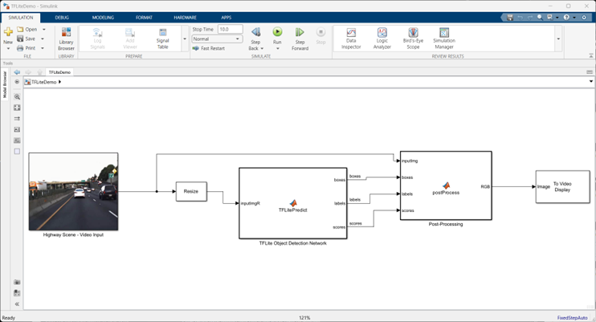


## 7.3.  Simulate a Simulink model directly from Python

In the third scenario, we start to look at the reverse problem, of
calling Simulink from Python. I encounter this scenario a lot when it
comes to test and automation of simulations by DevOps engineers, often
as part of a [CI/CD process](https://about.gitlab.com/topics/ci-cd/).

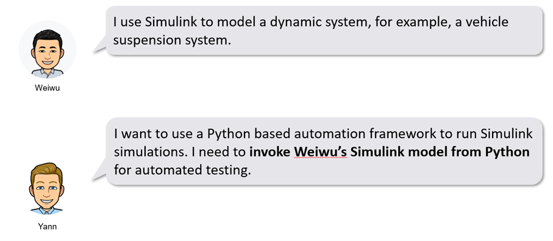

In this scenario and the next one, we will be using a road suspension model.

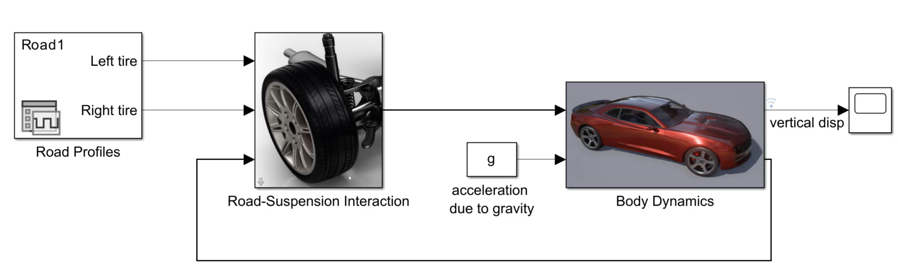

The first step is to use MATLAB functions to wrap the simulation. This function can make use of the simulation input object  in order to update the model parameters (in this case the body mass). Next, you need to use the sim  command in order to run the simulation in batch. You can then post-process the simulation results in MATLAB and/or Python.

**MATLAB functions:**

```matlab
function res = sim_the_model(args)
% Utility function to simulate a Simulink model with the specified parameters.
% 
% Inputs:
%    StopTime: simulation stop time, default is nan
%    TunableParameters:
%       A struct where the fields are the tunanle referenced
%       workspace variables with the values to use for the
%       simulation.
%    
%    Values of nan or empty for the above inputs indicate that sim should
%    run with the default values set in the model.
% 
% Outputs:
%    res: A structure with the time and data values of the logged signals.

arguments
    args.StopTime (1,1) double = nan
    args.TunableParameters = []
end

    %% Create the SimulationInput object
    si = Simulink.SimulationInput('suspension_3dof');
    %% Load the StopTime into the SimulationInput object
    if ~isnan(args.StopTime)
        si = si.setModelParameter('StopTime', num2str(args.StopTime));
    end
    
    %% Load the specified tunable parameters into the simulation input object
    if isstruct(args.TunableParameters) 
        tpNames = fieldnames(args.TunableParameters);
        for itp = 1:numel(tpNames)
            tpn = tpNames{itp};
            tpv = args.TunableParameters.(tpn);
            si = si.setVariable(tpn, tpv);
        end
    end

    %% call sim
    so = sim(si);
    
    %% Extract the simulation results
    % Package the time and data values of the logged signals into a structure
    res = extractResults(so,nan);

end % sim_the_model_using_matlab_runtime

function res = extractResults(so, prevSimTime)
    % Package the time and data values of the logged signals into a structure
    ts = simulink.compiler.internal.extractTimeseriesFromDataset(so.logsout);
    for its=1:numel(ts)
        if isfinite(prevSimTime)
            idx = find(ts{its}.Time > prevSimTime);
            res.(ts{its}.Name).Time = ts{its}.Time(idx);
            res.(ts{its}.Name).Data = ts{its}.Data(idx);
        else
            res.(ts{its}.Name).Time = ts{its}.Time;
            res.(ts{its}.Name).Data = ts{its}.Data;
        end
    end
end

function figHndl = plot_results(res, plotTitle)
%PLOT_RESULTS Plot results from call_sim_the_model

figHndl = figure; hold on; cols = colororder;


plot(res{1}.vertical_disp.Time, res{1}.vertical_disp.Data, 'Color', cols(1,:), ...
    'DisplayName', 'vertical displacement: 1st sim with default Mb value');
plot(res{2}.vertical_disp.Time, res{2}.vertical_disp.Data, 'Color', cols(2,:), ...
    'DisplayName', 'vertical displacement: 2nd sim with new Mb value');


hold off; grid; 

title(plotTitle,'Interpreter','none');
set(get(gca,'Children'),'LineWidth',2);
legend('Location','southeast');

end
```

**Python code:**

```python
import matlab.engine

mle = matlab.engine.start_matlab()  # start the matlab engine

# Allocate res list to hold the results from 2 calls to sim_the_model
res = [0]*2
# 1st sim: with default parameter values: Mb = 1200 Kg
res[0] = mle.sim_the_model('StopTime', 30)

# 2nd sim: with new values for tunable parameters
tunableParams = {
    # use a new parameter for body mass: Mb = 5000 Kg
    'Mb': 5000.0
}
res[1] = mle.sim_the_model('StopTime', 30, 'TunableParameters', tunableParams)

# callback into MATLAB to plot the results
mle.plot_results(res, "Results from sim_the_model using MATLAB Engine")

input("Press enter to close the MATLAB figure and exit ...")
mle.quit()  # stop the matlab engine
```

This code will produce the following MATLAB plot:

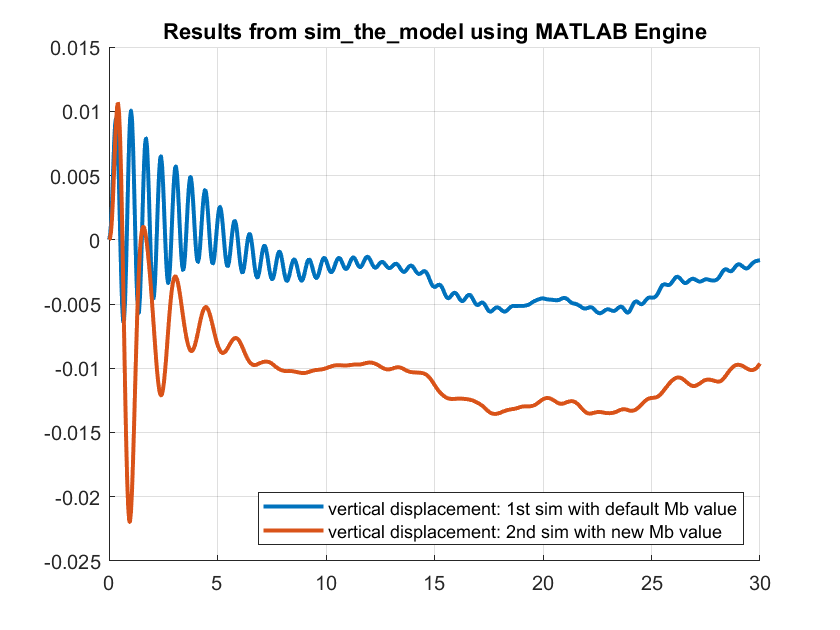

## 7.4. Export a Simulink model as a Python package for deployment

In the fourth scenario, the goal is to deploy a Simulink model into a
Python-based production system.

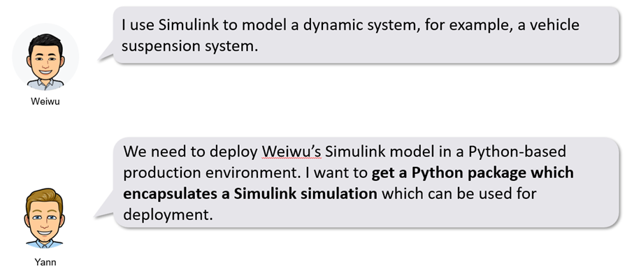

The steps are going to be the same here. The only difference is that you need to configure your model for deployment. That's because not all Simulink models are deployable. So you need to add the following line to transform the simulation input object before calling sim:

```matlab
si = simulink.compiler.configureForDeployment(si);
```

Then the next step is to compile the MATLAB function as a Python package:
    
```matlab
appFile = which('sim_the_model2');
outDir = fullfile(origDir,'sim_the_model2_python_package_installer');
compiler.build.pythonPackage(appFile, ...
        'PackageName','sim_the_model2', ...
        'OutputDir',outDir);
```

Finally, you need to install the Python package and call it from as such:

```python
import sim_the_model2
import matplotlib.pyplot as plt

# initialize sim_the_model package
mlr = sim_the_model2.initialize()

# Allocate res list to hold the results from 2 calls to sim_the_model
res = [0]*2
# 1st sim: with default parameter values: Mb = 1200 Kg
res[0] = mlr.sim_the_model2('StopTime', 30)

# 2nd sim: with new values for tunable parameters
tunableParams = {
    'Mb': 5000.0   # use a new parameter for body mass Kg
}
res[1] = mlr.sim_the_model2('StopTime', 30, 'TunableParameters', tunableParams)


# Plot the results
cols = plt.rcParams['axes.prop_cycle'].by_key()['color']
fig, ax = plt.subplots(1, 1, sharex=True)
ax.plot(res[0]['vertical_disp']['Time'], res[0]['vertical_disp']['Data'], color=cols[0],
        label="vertical displacement: 1st sim with default body mass Mb")
ax.plot(res[1]['vertical_disp']['Time'], res[1]['vertical_disp']['Data'],
        color=cols[1], label="vertical displacement: 2nd sim with updated body mass Mb ")


ax.grid()
lg = ax.legend(fontsize='x-small')
lg.set_draggable(True)
ax.set_title("Results from sim_the_model using MATLAB Runtime")
plt.show()

mlr.terminate()  # stop the MATLAB Runtime
```

This code will produce the following Python plot:

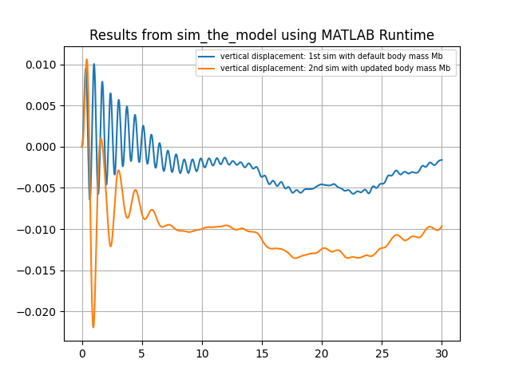